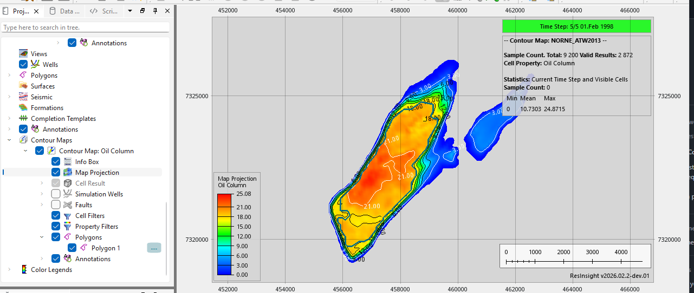
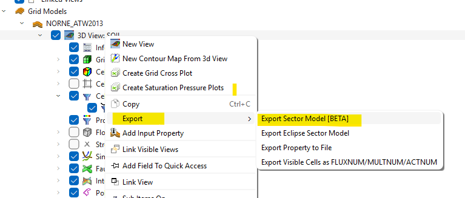

# Well Planning Guide

## Overview

Well Planning in ResInsight enables you to identify and evaluate new well targets, configure production constraints, and run simulations to assess well performance. This guide walks through the complete workflow from simulation setup to well analysis.

---

# Getting Started

## Configure OPM Flow Simulator

ResInsight can start simulations using the OPM Flow simulator. The simulator path must be configured in the **Preferences** menu.

**Example path:** `/usr/bin/flow`

### Windows and WSL

When using Windows with the Windows Subsystem for Linux (WSL):

1. Select the WSL distribution in **Preferences**
2. Specify the simulator path using the Linux file system path (not Windows path)

**Example Linux path:** `/usr/bin/flow`

---

# Simulation Workflow

## Step 1: Run Simulation via Job

To execute a simulation and automatically load results in ResInsight:

1. Open the **Scripts/Jobs** window
2. Right-click on **Jobs** and select **New OPM Flow Simulation**
3. Select the simulation data file (e.g., `norne-atw2013/NORNE_ATW2013.DATA`)
4. Choose an output folder in a scratch location (e.g., `norne-full-field`)
5. *(Optional)* Tick **Pause before running OPM Flow** to inspect the data file before execution
6. Run the simulation — results will automatically load in ResInsight

### Schedule File Variants

The INCLUDE statement in `NORNE_ATW2013.DATA` references `BC0407_HIST01122006.SCH`. Three versions are available — swap the filename in the INCLUDE to change simulation speed vs. detail:

| File | Timesteps | Period | Use case |
|---|---:|---|---|
| `BC0407_HIST01122006-very_short_history.SCH` | 3 | Nov–Dec 1997 only | Quick smoke test, minimal run time |
| `BC0407_HIST01122006-yearly-reporting.SCH`  | 10 | 1997–2006 (yearly) | Balanced: full history span, ~25× faster than complete |
| `BC0407_HIST01122006-complete.SCH` | 247 | 1997–2006 (monthly) | Full accuracy, longest run time |

To switch, edit the INCLUDE line in `NORNE_ATW2013.DATA`:

```
INCLUDE
'./INCLUDE/BC0407_HIST01122006-very_short_history.SCH' /
```

---

## Step 2: Analyze Results with Contour Maps

Contour maps visualize property distributions in the reservoir. They can be used to identify target zones and create selection polygons.

**To create a contour map:**

1. In the Project Tree, right-click the 3D view and select **New Contour Map from 3D View**
2. Select the last time step to analyze final conditions
3. Configure the map:
   - Set **Map Projection** as needed
   - Set **Result Aggregation** to **Oil Column**
4. Enable **Value Filter** and set threshold to **18** (or desired value) — select **Above** to show values exceeding threshold
5. Right-click the contour map and select **Create Polygon From Contour Map**
6. Review and rename polygons for further use



---

## Step 3: Export Sector Model from Filtered Region

Create a reduced model by filtering cells spatially:

1. Select the 3D view in the Property Editor
2. Right-click **Cell Filters** and select **Polygon Cell Filter**
3. Right-click the 3D view and select **Export Sector Model [BETA]**
4. Choose output folder (e.g., `norne-sector`) and use default settings



---

## Step 4: Simulate Sector Model

Run the exported sector model to verify grid properties:

1. Create a job from the exported `*.DATA` file
2. Set the export subfolder to `job`
3. Run the simulation and verify grid geometry and properties

---

# Well Planning and Configuration

## Add a New Well

To define a new well path and configure production constraints:

1. Create a new well and perforation interval positioned strategically (e.g., below existing well perforations like **B-2H**)
2. Select the Job object and configure:
   - Enable **Add New Well** and select the well path
   - Set **Well Group Name** (e.g., `B1-DUMMY`)
3. Open the **WCONPROD** group to set production constraints (see example below)
4. Enable **Append Extra Dates** to extend the simulation date range
5. Review summary plots to analyze well performance

### Production Constraint Example

| Parameter | Value |
|---|---:|
| Max Surface Oil Production Rate | 4000 |
| Max Surface Water Production Rate | 5000 |
| Max Surface Liquid Production Rate | 5000 |
| Max Bottom Hole Pressure | 50 |

