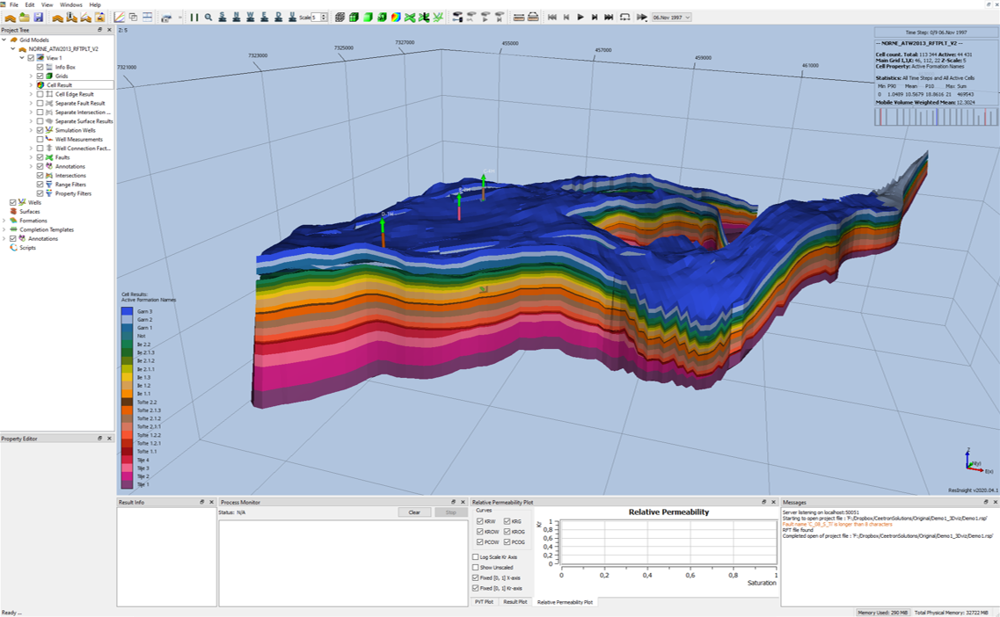
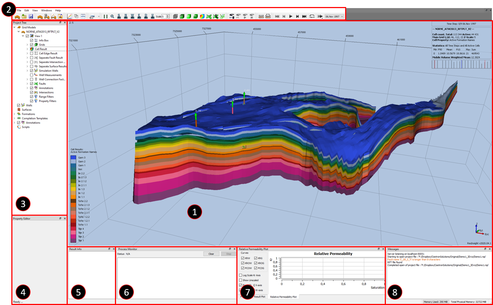
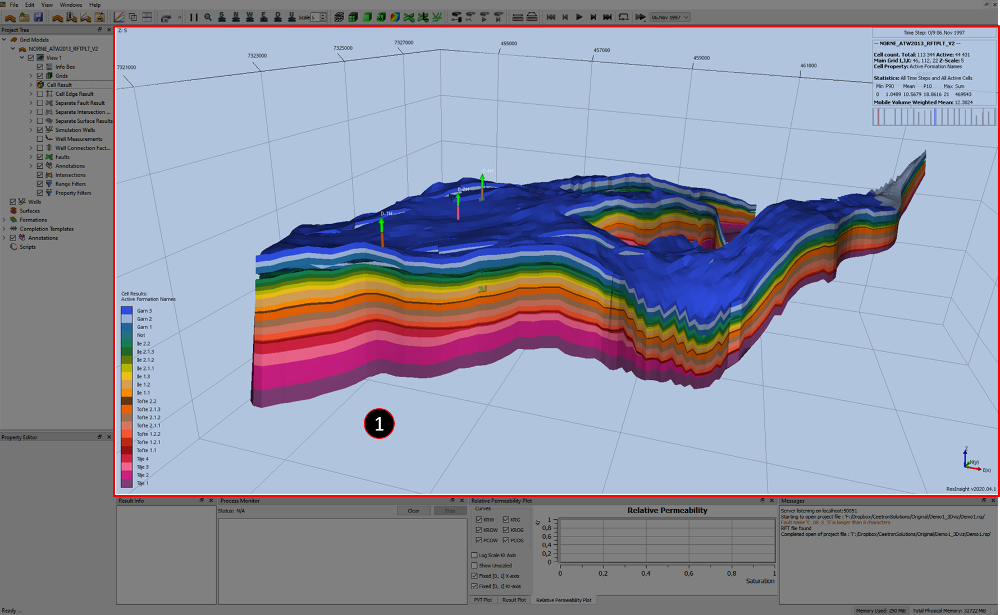
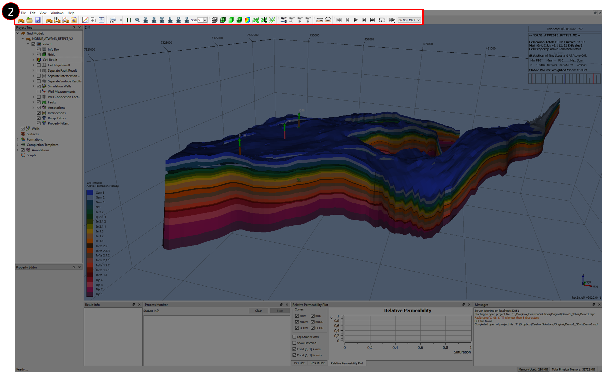
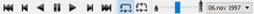
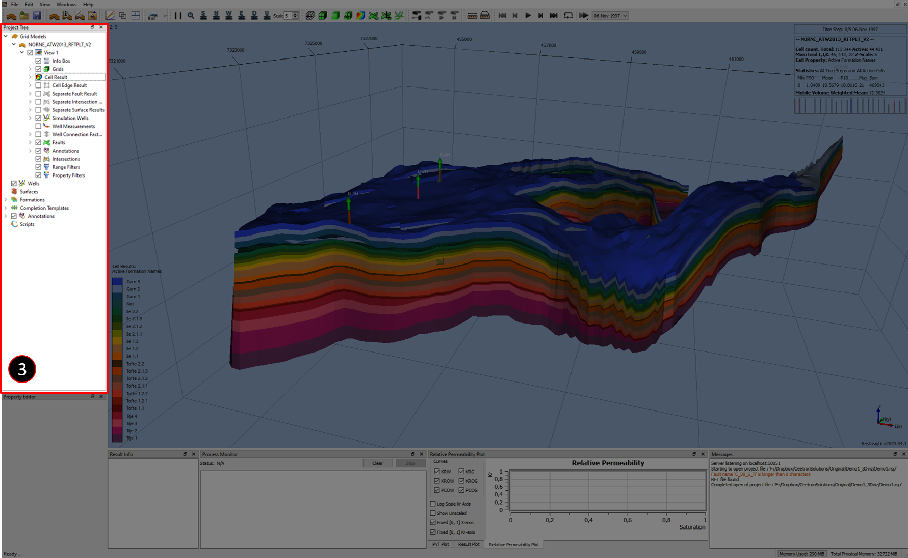
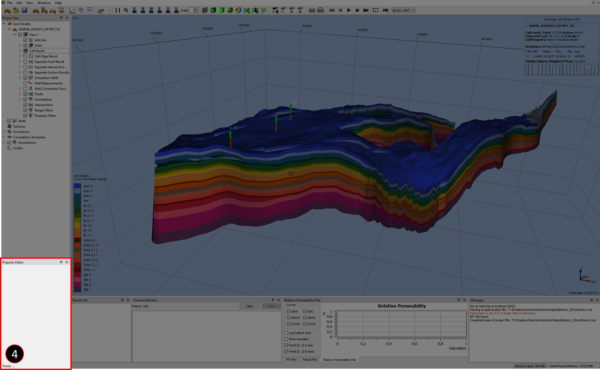
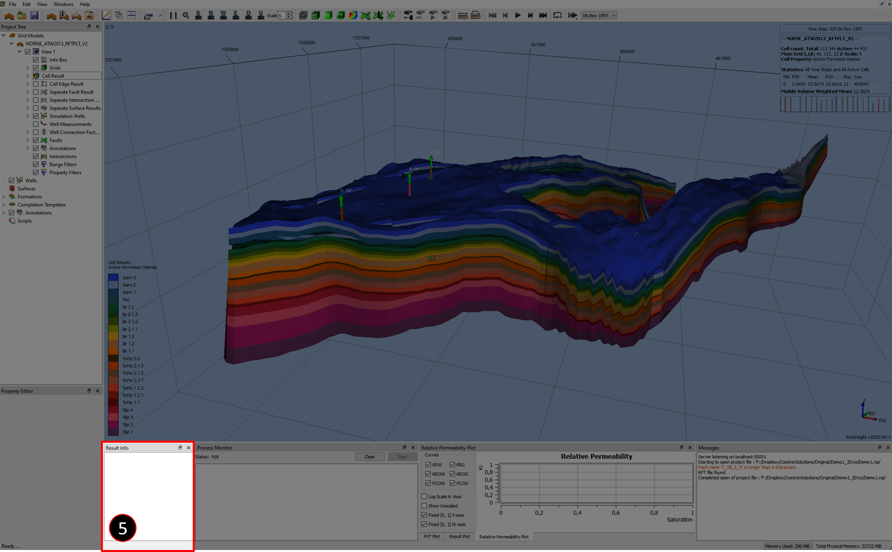
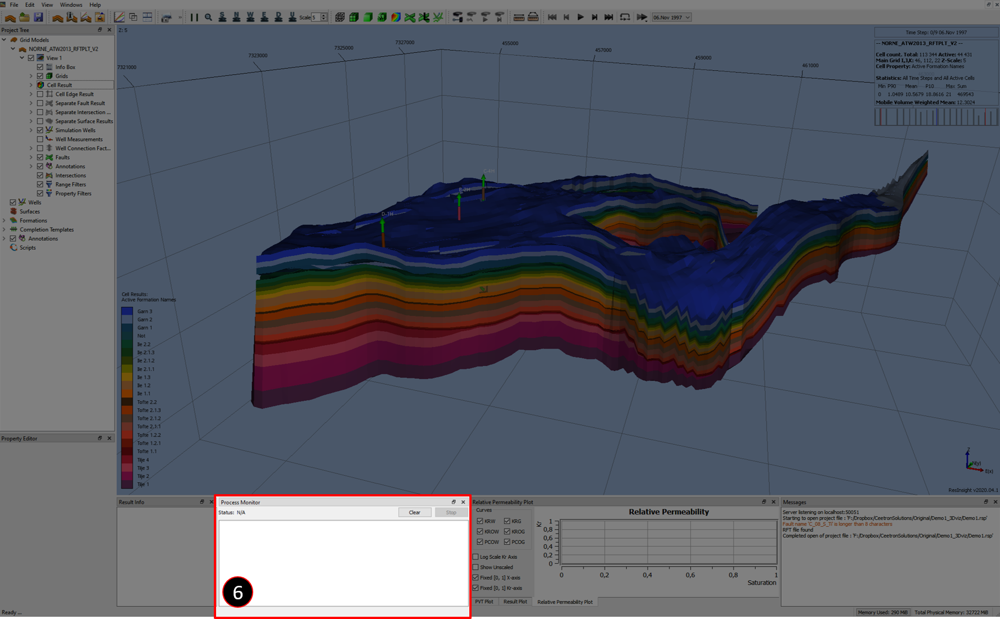
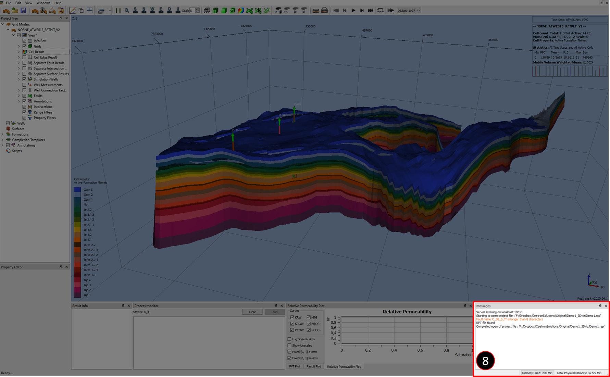

# ResInsight - Graphical User Interface

The ResInsight user interface is made for customization. The sub-windows adapts according to your actions to provide additional relevant information. In this tutorial the standard layout is explained to allow for an easier transition to more advanced operations. The Buttons on the top are directly related to either the project or your current **View** in the Property Tree.

# Overview

1. [Reservoir View](#reservoir-view)
2. [Quick access buttons](#quick-access-buttons)
3. [Project Tree](#project-tree)
4. [Property Editor](#property-editor)
5. [Result Info](#result-info)
6. [Process Monitor](#process-monitor)
7. [Messages](#messages)

# Reservoir View

# Quick access buttons

## Project/File Management buttons

These buttons are used for Loading and Saving projects and Eclipse Files.

## Window Management buttons

These buttons provides access to the Plot Window, linking different **Views**, and "Tile View" to better organize your visual experience with the reservoir.

## Snapshot Tools

These buttons allows for tailoring of the Screen Capture tools. The options are to print the current **View** to your clip-board (Equivallent to Ctrl + C), save your current **View** to a file, and to save all of your **Views** to files.

## View (orientation and transformation) buttons

"Parallel View" / "Perspective View" adjusts the view accordingly. "Zoom all" adjusts the visualization to include the entire reservoir. "Look South(/North/West/East/Down/Up)" buttons are helpful for aligning your view with the different axis.  "Scale" allows you to scale the Z-axis.

## Draw Style buttons

Gives you access to the different modes of visualizing the reservoir in terms of lighting, mesh, surfaces, faults, and wells. 

"Mesh Only", allows you to visualize the wire-frame of all selected cells. 

The "Mesh and Surface" provides you with the wire-frame of all selected cells in addition to drawing the surfaces of the cells colored according to your currently selected **Cell Result**.

"Surface Only" omits the wire-frame of each cell and displays the surfaces according to the currently selected **Cell Results**.

"Fault Mesh and Surfaces" shows the mesh of faults and the surfaces of all selected cells.

"Enable/Disable Result Lighting" turns on or off the dynamic result lighting.

"Hide Grid Cells" omits all cell surfaces and wire-frames. If any **Faults** or **Wells** are checked in the **Property Tree** only these will be visible.

"Show Fault Labels" draws all the labels of currently selected **Faults** in the **Property Tree**.

"Show Wells" will display all the currently selected active **Simulation Wells** in the **Property Tree**. It will by default display all the cells that each well penetrates, colored in the currently selected **Cell Results**.

## Animation buttons

The animation buttons will helps visualize the reservoir chronologically through time, either backwards or forwards. Or at a given report step.

"Skip to Start" sets the current state of the reservoir to the first report step.

"Step Backwards" set the current state of the reservoir to the previous report step.

"Play Backwards" plays the sequence of report steps backwards from the current state.

"Pause" pauses the animation sequence.

"Play Forwards" plays the sequence of report steps forwards from the current state.

"Step Forwards" set the current state of the reservoir to the next report step.

"Skip to End" sets the current state of the reservoir to the last report step.

"Repeat from Start" enables the animation to play in a loop. If played forwards it will start from the first report step every time. If the animation run backwards in time it will start from the last report step.

"Repeat Forward/Backward" loops the reservoir both backwards and forwards in time. It will run from the current state to either the first or last report step, when such a step is reached the direction in time will switch.

 "Animation Speed" this slider indicates the interval (time) of which each report step is drawn on the screen. 

 "Current Time Step" is a drop-down menu in which one is able select from the report step included in the Eclipse deck.

# Project Tree
[Back to overview](#overview)

The purpose of the Project Tree exist to manage the views and thereby what will be visualized in the main windows. There can be multiple models, views, and properties. Properties can be filtered in several ways and combinations of their location, property value and geometrical indexing.

# Property Editor
[Back to overview](#overview)

# Result Info
[Back to overview](#overview)

# Process Monitor
[Back to overview](#overview)

# Messages
[Back to overview](#overview)

