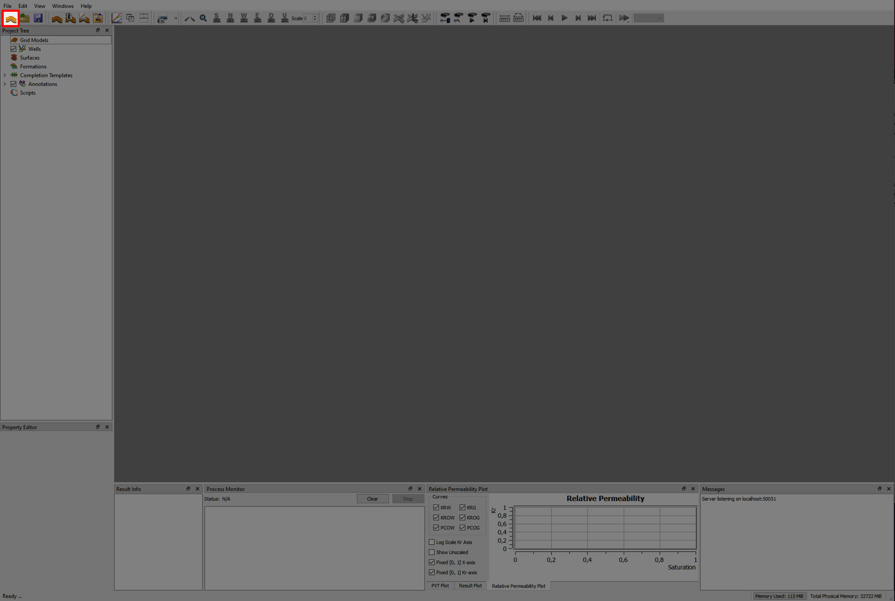

# 3D Grid Visualization

## Step 1 - Import Eclipse Case

Import grid data by using the "Import Eclipse Case"-button from the folder "Demo1_3DViz"

## Step 2 - Visualizing Dynamic Properties

In the Property Editor