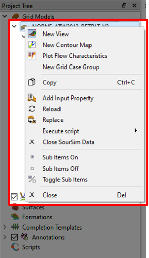
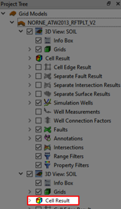
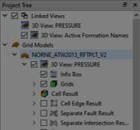

# 3D Grid Visualization

## Step 1 - Import Eclipse Case

Import grid data by using the "Import Eclipse Case"-button from the folder "Demo_1_3DViz"

## Step 2 - Visualizing Dynamic Properties

In the [**Project Tree**](../Demo_0_Interface/Demo_0_Interface.md#project-tree) select [**Cell Results**](../Demo_0_Interface/Demo_0_Interface.md#cell-results), then navigate to the [Property Editor](../Demo_0_Interface/Demo_0_Interface.md#property-editor) and select a "Type", in this case Dynamic. Further, find the "PRESSURE" property from the drop-down menu and select it. This will load the property on to your current view.

## Step 3 - Animation and Report Steps

Use the Play button in the [animation button](../Demo_0_Interface/Demo_0_Interface.md#animation) to get to the last step. Make sure that neither the "Repeat From Start" nor the "Repeat Forwards/Backwards" are checked. You can also select the last time step by using the drop-down menu in the [animation](../Demo_0_Interface/Demo_0_Interface.md#animation) part of the quick access bar.

## Step 4 - Import formation names

Navigate to `File->Import->Import Formation Names` and import the formation names from the `Norne_ATW2013.lyr` file.

## Step 5 - Create a new View and Display Formations

Navigate back to the [**Project Tree**](../Demo_0_Interface/Demo_0_Interface.md#project-tree) and right-click on "NORNE_ATW2013_RFTPLT_V2" and select "New View" as illustrated in the above picture.

In View 2 select Cell Result and then Navigate back to the [Property Editor](../Demo_0_Interface/Demo_0_Interface.md#property-editor) and select a "Type", in this case "Formation Names" and click the "Active Formation Names" option.

## (OPTIONAL) Step 6 - Show and link multiple views

With the two views active you could click the "Tile Window" in the [Window management](../Demo_0_Interface/Demo_0_Interface.md#window-management) buttons to visualize both the Views simultaneously. You can even link the views to show the exact same positions by selecting the "Link" option from [Window management](../Demo_0_Interface/Demo_0_Interface.md#window-management) buttons.

 

If you click this button a pop-up window will appear and you can select the View 1. Additionally, a new menu will appear in the [**Project Tree**](../Demo_0_Interface/Demo_0_Interface.md#project-tree) that allows you to attach, detach and terminate links.
