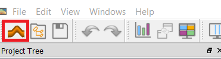
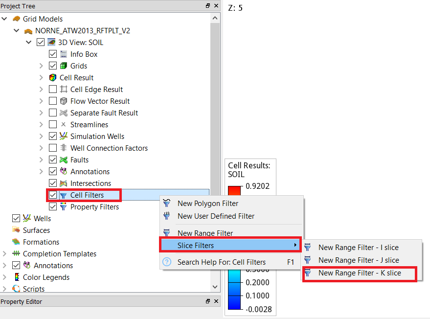
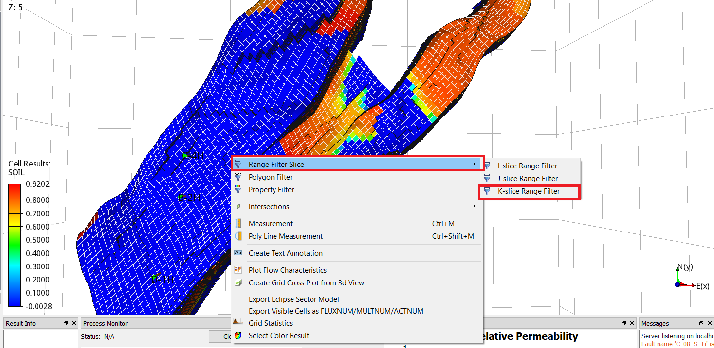
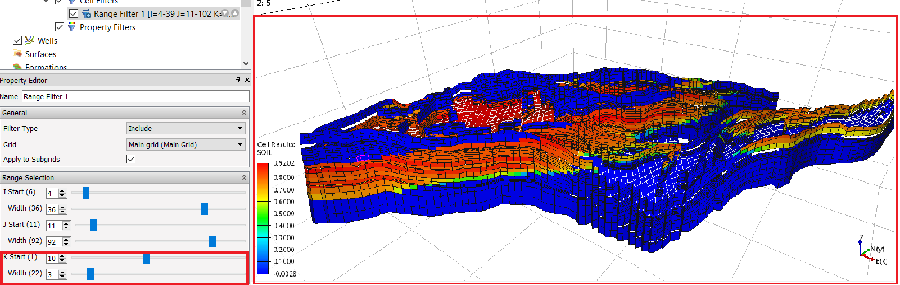
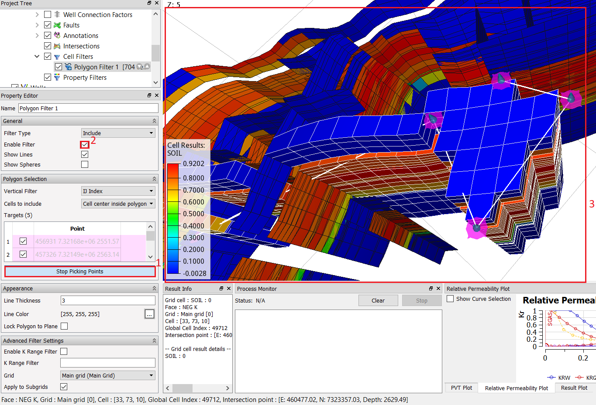

# Filters

This tutorial will provide an overview of different filters in ResInsight.

## Step 1: Import Eclipse Case

 

## Step 2: Create Cell Filters

In project tree, right click on "Cell Filters" and then select desired filter type 

 

### Range Filters

In project tree, right click on "Cell Filters" and then select slice filters and choose i or j or k slice filter as shown below.

If range filter is slected by either

 

Alternatively, one can add range filters directly from right click menu in 3D view and select the required filter type, as shown below.

 

Manipulate start point and width for the slice by changing the "range selction"  in property editor as shown in figure below and visualize its effect from 3D view.
 

 

### Polygon Filter

Once "Polygon Filter" is selected, it will allow user to start picking target points on 3D view, such that one can probe the reservoir for coordinates for the "Polygone". Once 
 

target points are slected, click on "Stop Picking Points" in property editro as shown in image below.

 

## Step 3: Create a Property Filter
In addition to cell filters, we also have property filters to fliter out cells based on values.

In project tree, right click on "Property Filter" and select "New property filter" as shown in the image below. By default, it will activate property filter for cell property SOIL, i.e., saturaiton of oil. Which can be changed to SWAT or other property from peroperty editor, as displayed below.
 

## Step 4: Combination of Multiple FIlters

 

## Step 5: Histogram info in 3D View
 

## Step 6: Grid Statistics Plot in 2D View

 

