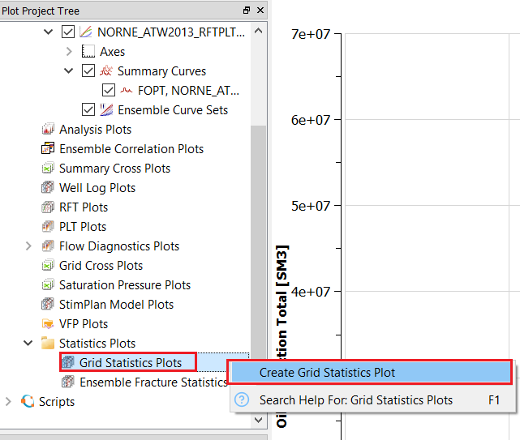
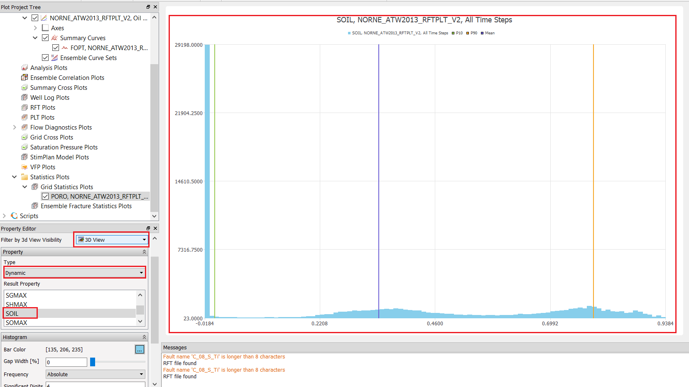

# Filters

This tutorial will provide an overview of different filters in ResInsight.

## Step 1: Import Eclipse Case

 

## Step 2: Create Cell Filters

### Range Filters

In project tree, right click on "Cell Filters" and then select slice filters and choose k slice filter as shown below.

 

Alternatively, one can add range filters directly from right click menu in 3D view and select the required filter type, as shown below.

 

When k slice fliter is selected, it will create a new item in porject tree and will have corresponding property editor activated as shown in image below.

 

Manipulate start point and width for the k slice by changing the "range selction"  in property editor as shown in figure below and visualize its effect from 3D view.
 

Now select j slice fliter from right click menu on 3D view on a cell

 

In similar fashion, add i slice fliter and deactive intersection from project tree. 3D view will look like following.

 

Manipulate start point of i/j/k slicer as per requirement and visualize corresponding changes in 3D view.

### Polygon Filter

Delete previously created slice filters and create "Polygon Filter", either from right click menu on 3D view, or from right click menue on Cell Filters in project tree. This will allow user to start picking target points on 3D view, such that one can probe the reservoir for coordinates for the "Polygon". Four points are selected as shown below:

 

Once desired points are picked, click on "Stop Picking Points" button in property editor, followed by enabling the filter as shown below. 

 

In addition, one can also try to lock the polygon plane and adjust the plane depth from perperty editor, as illustrated in image below.

 

## Step 3: Create a Property Filter

In addition to cell filters, there is option to create property filters to fliter out cells based on values.

In project tree, right click on "Property Filter" and select "New property filter" as shown in the image below.

 

By default, it will activate property filter for cell property SOIL, which can be changed as per requirement. Here, 3D view is illustrated for given range of SOIL.

 

## Step 4: Combination of Multiple FIlters

One can also have combination of multiple filters. Following illustrations shows combination fo polygon, range, and property filter. Do not that polygon filter is excluded here, therefore, creating a void in 3D view.

 

## Step 5: Histogram info in 3D View
By turning on "Info Box", statistical values corresponding to combination of filters can be found. 
 

## Step 6: Grid Statistics Plot in 2D View
Navigate to 2D plot window and under the statistics folder in Plot Project tree, right click on Grid Statistics Plots and create a Grid Statistics Plot, also illustrated in image below.

 

Then make the changes highlighted in red box and get the grid statistic plot corresponding to combination of filters applied earlier.
 

