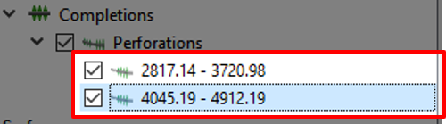

# Adding perforations to well-paths

## Step 1: Open an existing project

First, we open up the existing project. Click "File->Open Project" or press "Ctrl+O" navigate to "Resources/Model/add-perforation.rsp". Another possibility is to redo the tutorial [Making A Well](../making-a-well/making-a-well.md)

## Step 2: Create perforation Interval

To create a perforation interval, in the [Project Tree](../graphical-user-interface/graphical-user-interface.md#project-tree) right-click "Well-1" and select "Create Completions->Create Perforation Interval"

This will create a new sub-category that will show as "Completions" and "Perforations". It will initiate with the coordinate 0 measured depth (MD) to 0 MD. Select the item "0 - 0".

In the [Property Editor](../graphical-user-interface/graphical-user-interface.md#property-editor) there will appear two sliding options. These can be adjust to create an interval in terms of MD. If you are using the provided project "add-perforation.rsp" adjust the Start MD to be equal to 2780.3 and the End MD to be 4730.4. This will then create a perforation interval between these two coordinates. 

These two options control the geometry of the perforations and the "Skin Factor".

Ïn addition we can adjust the start and end-date by enabling "Custom Start Date" and/or "Custom End Date".

After having changed the interval as suggested above, we observe in the [Reservoir View](../graphical-user-interface/graphical-user-interface.md#reservoir-view) that the
perforated interval is highlighted in a green color.

## Step 3: Create multisegmented perforations

We can then add another interval to our existing well.

As performed in [Step 2](#step-2:-create-perforation-interval) adjust both intervals to the values illustrated above by manipulating the Start MD and End MD in the Property Tree.

The green perforations should now look similar to the above picture. Indicating that you have successfully created multi-segmented perforations.

These perforations can now be exported by right-clicking the Perforation option in the Project Tree and selecting the "Export Completion Data for Current Well Path".

## Step 4: Create fishbones completion

To add fishbones completion we right-click the Completion option in the Project Tree and select "Create Completions->Create Fishbones".

If you have never created fishbones before, you will be prompted by ResInsight to set the scaling factor to 1 to better visually represent the fishbone structure. In our case we click select "Yes"

We can now observe the initial configuration of the fishbones completions in the Reservoir View.

In the Property Editor new options have been made available. The first sub-category named "Location" enables you to adjust the positioning of the fishbone completions.

The second sub-category is the "Lateral Configuration", here you can adjust the layout of the fishbones. At what angles, how dense, and orientation the laterals should leave the main trajectory. Adjust these settings and observe the effects in the Reservoir View.

After having tested different combinations, you can export the current completion data by right-clicking the "Fishbones" option and navigating to "Export Completions->Export Completion Data for Current Well Path".

## Step 5: Create Fracture

We can now add a Fracture to the trajectory. By again right-clicking the Completions and navigating to "Create Completions->Create Fracture".

The Fracture will be initialised at 0 MD. In the Property Editor adjust the slider such that a blue circle enters the Reservoir View. (If the "add-perforation.rsp" is the project you can se the MD to be equal to 4305.53)

In the Reservoir View, the fracture should look similar to the picture above.

All fractures are created from a template, this template can be edited by clicking the "Edit" option in the Property Editor.

A new menu will appear, here you can adjust different parameters of the fracture including the permeability. In this tutorial we will only adjust the direction of the fracture. Feel free
to adjust any setting here and observe the effects in the Reservoir View.

By selecting the "Fracture Orientation" a drop-down menu will appear, select the "Along Well Path" option.

In the Reservoir View the fracture should now look similar to this, depending on how much you altered the configuration in previous steps.

The fracture can now be exported by right-clicking the "Fractures" option in the Project Tree and navigating to "Export Completions->Export Completion Data for Current Well Path"

## Step 6: Export all completion data

All completion data for this well can be exported by right-clicking the Completions option in the Project Tree and navigating to "Export Completions->Export Completion Data for Current Well".

