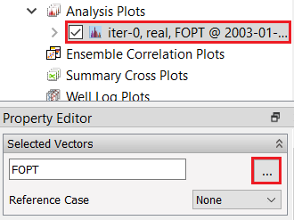
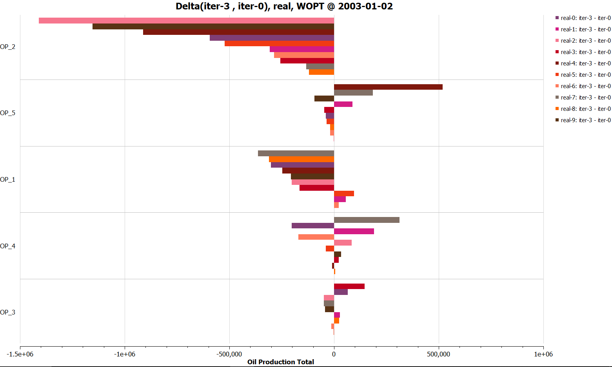

# Create and Configure an Analysis Plot

## Step 1: Import a Summary Ensemble

Refer to [Import Summary Ensemble](../import-summary-ensemble/import-summary-ensemble.md) tutorial to import an ensemble for iter-0 of reek ensemble.

Follow the same procedure to import another summary ensemble corresponding to "iter-3" and name it "iter-3".

## Step 2: Create a Delta Ensemble 

 

Select "New Delta Ensemble" from right-click on "Summary Cases" as shown above.

 

Create a Delta Ensemble as the difference between the two cases (iter-6-iter-0)

## Step 3: Create Analysis Plot

 

In project tree, right click on "Analysis Plot" and select new Analysis Plot as displayed in screenshot above. It will create an analysis plot named "iter-0, real, FOPT @ 2003-01-02" and will activate new items in property editor.

 

In Property Editor, in group Selected Vectors, click on the button with three dots “…” as illustrated above. It will open up plot editor window. Uncheck box for iter-0 and Set source to Delta ensemble, select well OP_1-5 and summary Vector WOPT as shown below. Once desired property is selected, click "OK". 

  

## Step 4: Configure Analysis Plot

 

Change bar setting configuration (Bar Orientation: Horizontal, Select Summary Item in Major Grouping  and sort by abs(Value) as illustrated in the figure above. This will give you analysis plot similar to following. Activate Bar labels and show/hide legends.

 

