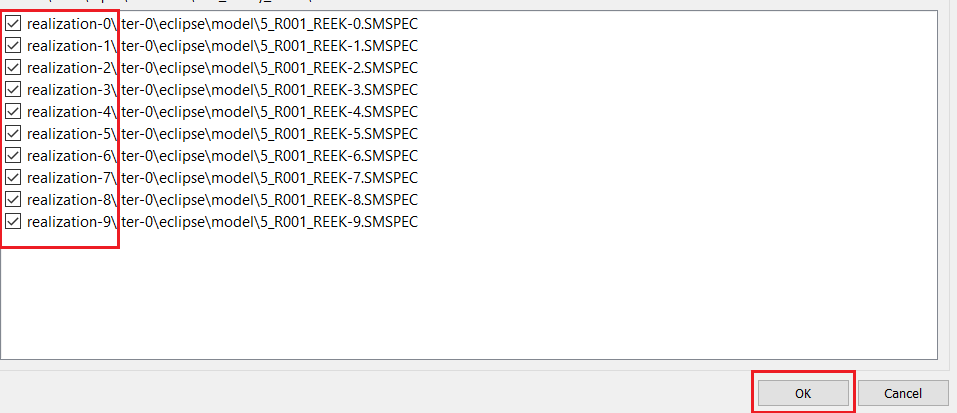

# Create and Configure an Analysis Plot

## Step 1: Import a Summary Ensemble
 

Navigate through the "File" drop-down menu and select 'Import->Summary Cases->Import Summary Ensemble' as shown above. 

 

A prompt will appear; select the "..." (as illustrated in the above picture) and navigate to the folder which contains the ensemble. It will appear a file-path to the folder you have selected. In our case we are using the Reek ensemble. 

 

The Reek ensemble we are working with contains 9 realization each having four iterations ranging from iter 0 to iter 3. To import the iter-0 ("base_pred") we add the following syntax to the file path: "\*/iter-1/\*", the astrix symbol ("\*") means that it will match any number of any character. As the above illustration shows, press the "Find" it will search for all the ".SMSPEC" files associated with the "iter-0".

Select realization 0 through 9, as illustrated in the above screenshot and click 'ok'. This will open up a new prompt will appear; asking you to name the ensemble. We will call this "iter-1". Then press "OK".

Similarly import another summary ensemble corresponding to "iter-3" and name it "iter-3".

## Step 2: Create a Delta Ensemble 

 

Select "New Delta Ensemble" from right-click on "Summary Cases" as shown above.

 

Create a Delta Enseble as the difference between the two cases (iter-6-iter-0)

## Create Analysis Plot
