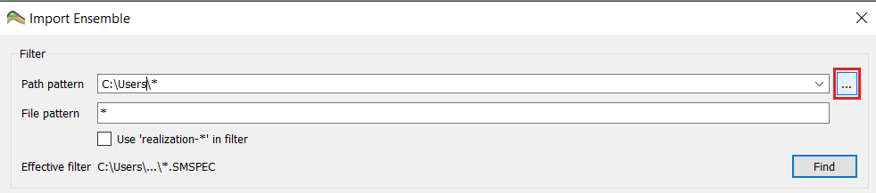
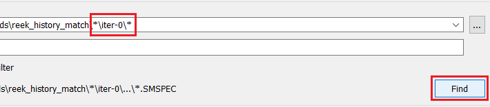
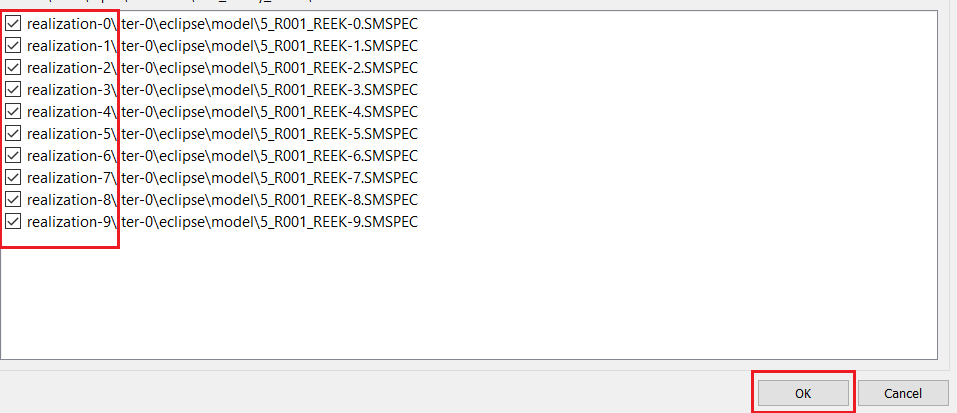
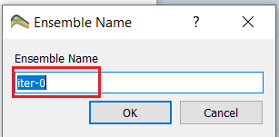
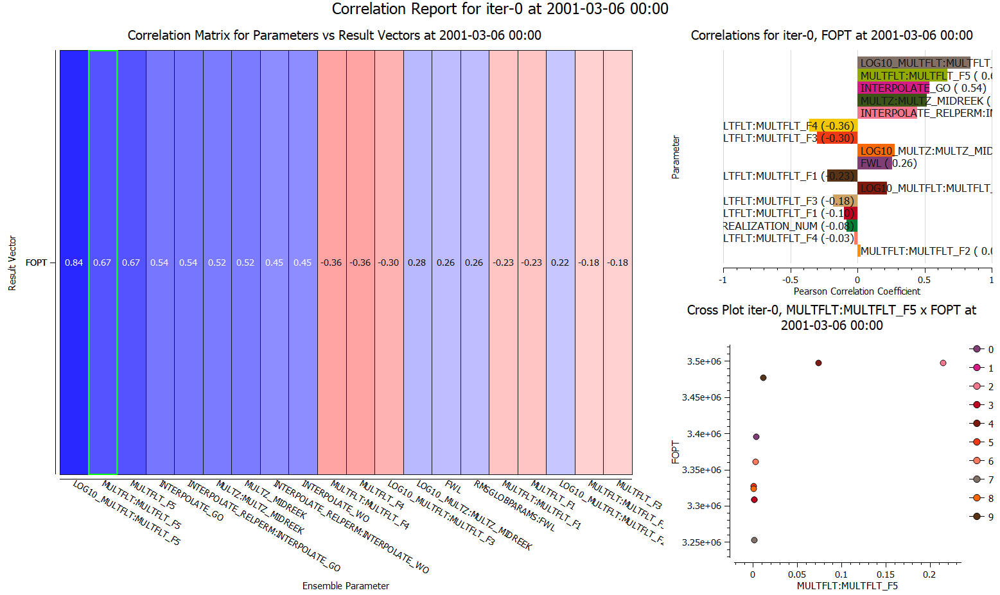
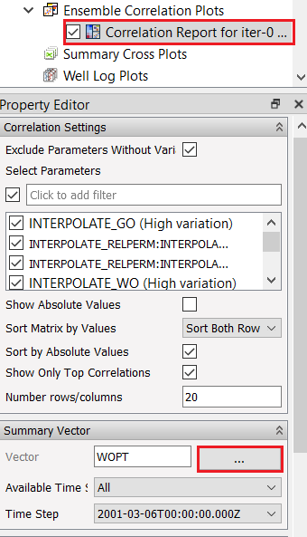
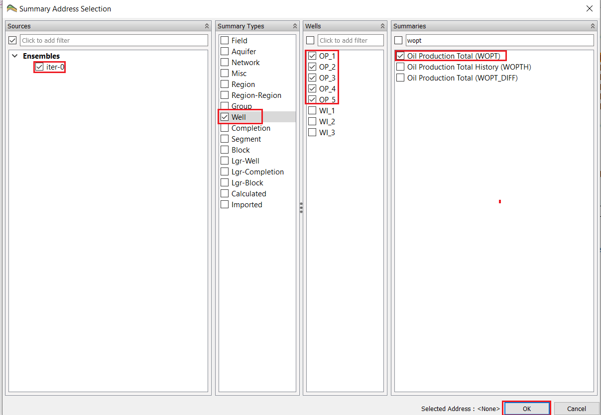
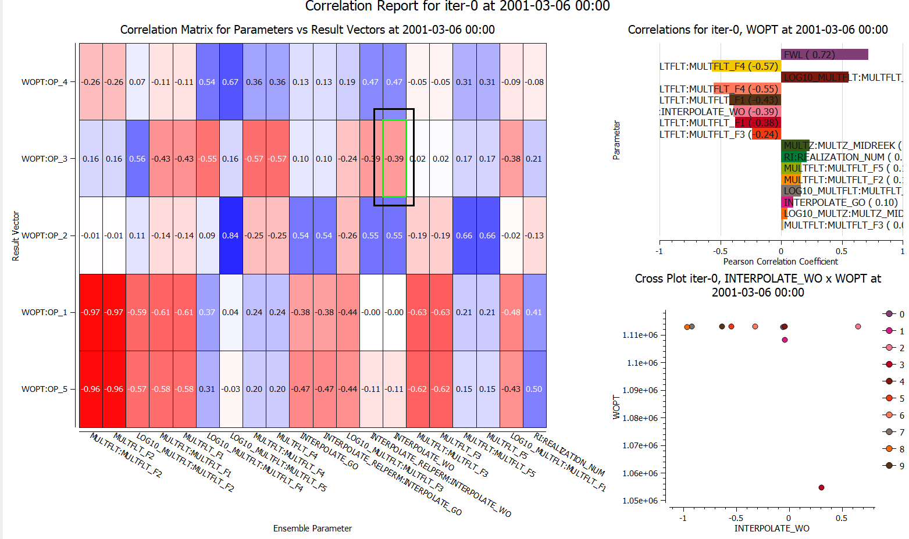

# Create and Configure a Correlation Plot

## Step 1: Import a Summary Ensemble
 

Navigate through the "File" drop-down menu and select 'Import->Summary Cases->Import Summary Ensemble' as shown above. 

 

A prompt will appear; select the "..." (as illustrated in the above picture) and navigate to the folder which contains the ensemble. It will appear a file-path to the folder you have selected. In our case we are using the Reek ensemble. 

 

The Reek ensemble we are working with contains 9 realization each having four iterations ranging from iter 0 to iter 3. To import the iter-0 ("base_pred") we add the following syntax to the file path: "\*/iter-0/\*", the astrix symbol ("\*") means that it will match any number of any character. As the above illustration shows, press the "Find" it will search for all the ".SMSPEC" files associated with the "iter-0".

Select realization 0 through 9, as illustrated in the above screenshot and click 'ok'. 

This will open up a new prompt will appear; asking you to name the ensemble. We will call this "iter-0". Then press "OK".

## Step 2: Create Correlation Plot

 

A plot will appear showing the "Iter-0, Oil Production Total". From the right-click of the curve, select “Create Correlation Plot from Curve Point ->New Report Plot”

## Step 3: Pearson Calculation
 

 
This will open up the report plot. Currently selected cell is indicated by a green border.

#### To try 
click on the individual correlation matrix, and see how the cross plot is updated as illustrated above for one martix. 

## Step 4: Showing data for all the wells

 

In the property editor window under Summary Vector, click on "..." ,it will open up Summary Address Selction Window as displayed in image below. Change data source to WOPT for all wells OP_1 to OP_5.

 

New correlation plot will look like what shown below.

 

To try- click on the individual correlation matrix to see how the cross plot is updated as illustrated above for one martix. 

