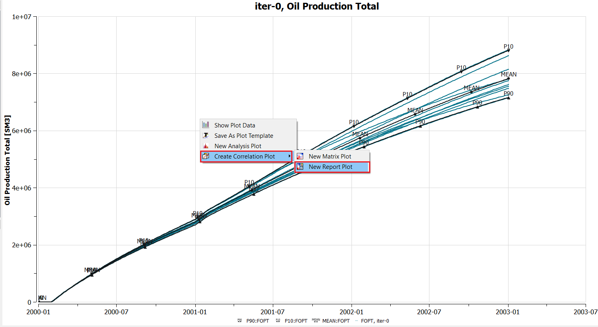

# Create and Configure a Correlation Plot

## Step 1: Import a Summary Ensemble

Refer to [Import Summary Ensemble](../import-summary-ensemble/import-summary-ensemble.md) tutorial to import an ensemble for iter-0 of reek data.

## Step 2: Create Correlation Plot

 

A plot will appear showing the "Iter-0, Oil Production Total". From the right-click of the curve, select “Create Correlation Plot from Curve Point ->New Report Plot”

## Step 3: Pearson Calculation
 

 
This will open up the report plot. Currently selected cell is indicated by a green border.

#### To try 
click on the individual correlation matrix, and see how the cross plot is updated as illustrated above for one martix. 

## Step 4: Showing data for all the wells

 

In the property editor window under Summary Vector, click on "..." ,it will open up Summary Address Selction Window as displayed in image below. Change data source to WOPT for all wells OP_1 to OP_5.

 

New correlation plot will look like what shown below.

 

To try- click on the individual correlation matrix to see how the cross plot is updated as illustrated above for one martix. 

