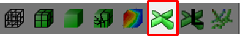
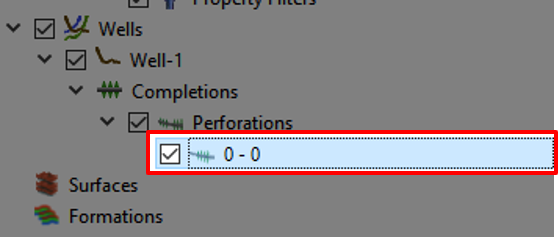

# Create and export Local Grid Refinements

## Step 1 - Import Eclipse Case

Import grid data by using the "Import Eclipse Case"-button and locate the folder "Resources/Model".

## Step 2 - Import a well

In the Project Tree; right-click on the Wells tab. Navigate to "Import->Import Well Paths from File", navigate to "Resources/Model" and import "Well-1".

## Step 3 - Create a visual guide

We can now create an intersection following the well, this will help us as a visual guide for what happens with the well. Right-click "Well-1" and click on the "Create Intersection"

In the [Quick Access Bar](../graphical-user-interface/graphical-user-interface.md#quick-access-bar) click the "Hide Grid Cells" option.

The [Reservoir View](../graphical-user-interface/graphical-user-interface.md#reservoir-view) should now include one intersection following the our imported well path, in addition there should be multiple simulated wells. We can deselect the simulated wells by unchecking the box, as illustrated in the picture above.

## Step 4 - Create Perforation Intervals

To create the first of two intervals, we right-click "Well-1" and select "Create Completions->Create Perforation Interval".

Make sure that the Perforation "0 - 0" is selected.

Move to the [Property Editor](../graphical-user-interface/graphical-user-interface.md#property-editor) and adjust the values to Start MD to 2817.14 and End MD to 3720.98

We are now able to add another perforation interval by right-clicking the current interval, "2817.14-3720.98", or "Perforations" and selecting "Create Perforation Interval".

In the same fashion as with the first interval, head down to the Property Editor and adjust the values. Start MD to 4045.19 and End MD to 4912.19.

The Reservoir View should now look similar to this. The green parts illustrate the perforation intervals.

## Step 5 - Create LGR

We are now able to add the LGR. By right-clicking on "Well-1", navigate and click on "Create Completions->Create Temporary LGR". 

A pop-up menu will appear, here you can adjust the Grid Refinement by specifying the Cell Count. In our case, we want to set these values to be 5 in every cell.

Click on the "OK" button to confirm your choice.

## Step 6 - Display the newly created LGR

In the Project Tree, go to the grid section and organize the "checked boxes" such as illustrated in the picture above.

As illustrated in this picture, in the Reservoir View where there were green perforated intervals before there should be smaller grid-cells surrounding. You can also uncheck the "Intersection" tab in the Project Tree to visually inspect the LGRs.

## Step 7 - Export LGR

After having performed our visual inspection, we can now export the LGR by navigating back to the Project Tree and right-clicking on the "Temporary LGR" and clicking the "Export Completion Data". After having confirmed this, a new file will appear in the folder you have selected.

## References:

For further information, head to the reference section on ResInsight.org: https://resinsight.org/wells-and-completions/completionslgr/