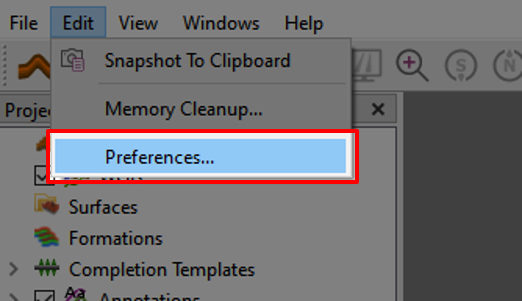
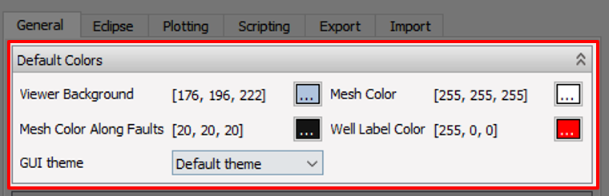
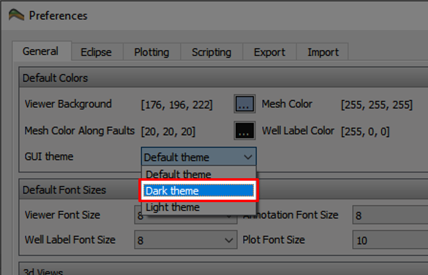
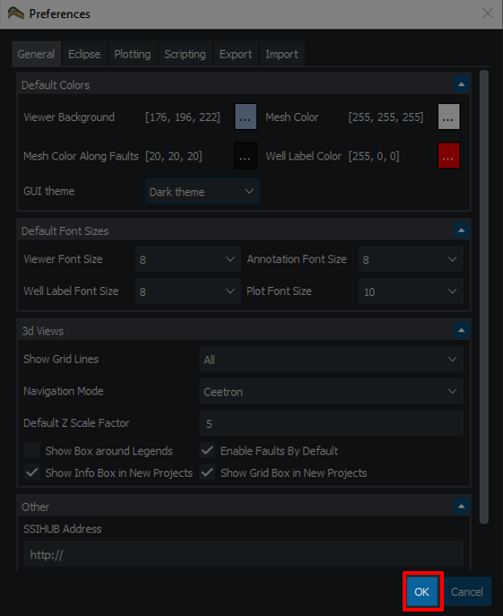
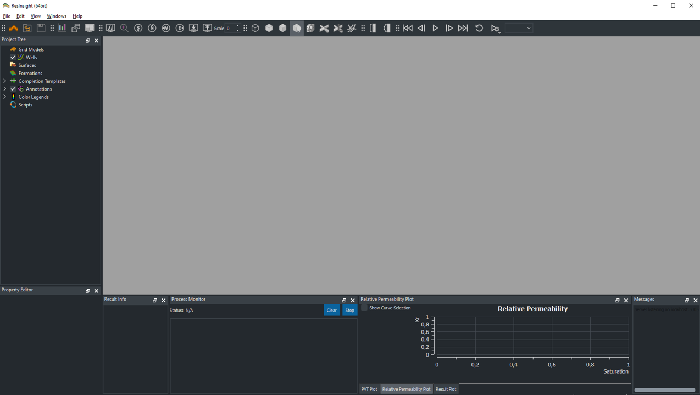

# Enabling Dark Theme

## Step 1

Open the Preference Menu, by clicking "Edit->Preferences.." as illustrated above.

## Step 2

In the Preference Menu; the color options are available in the first menu.

## Step 3

Use the drop-down menu from "GUI Theme" and select "Dark Theme".

## Step 4

## Final Result

## References:

For additional information, visit the release notes for 2020.10 at: https://resinsight.org/getting-started/whats-new/releasenotes_2020_10/