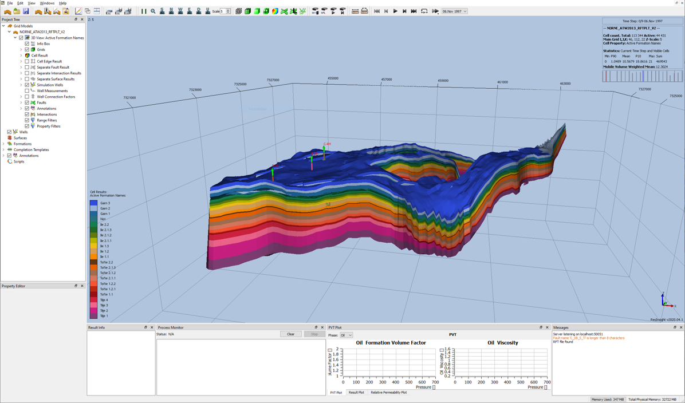
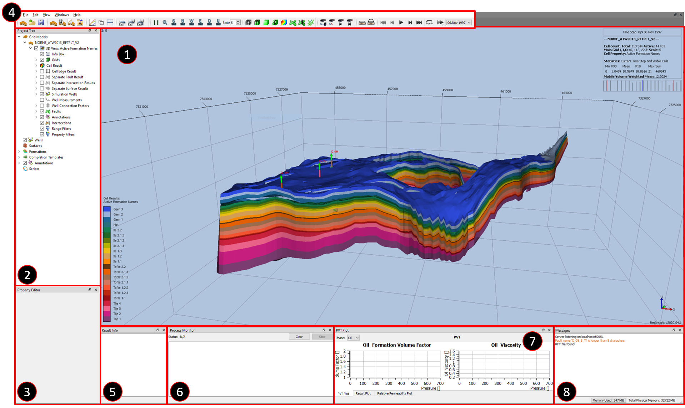
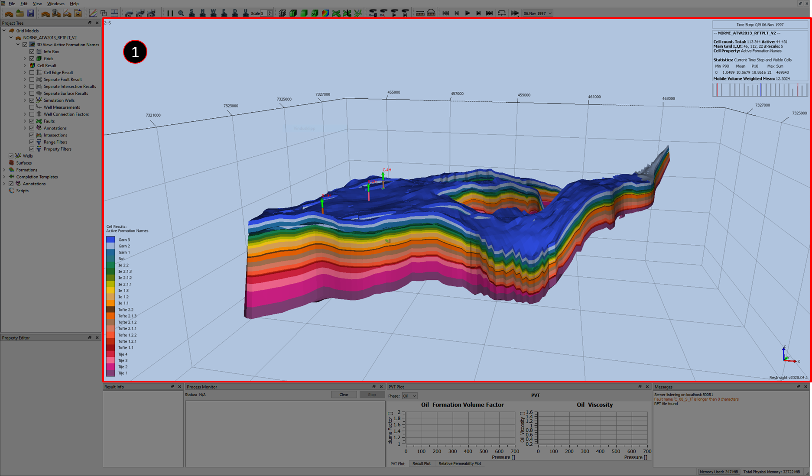
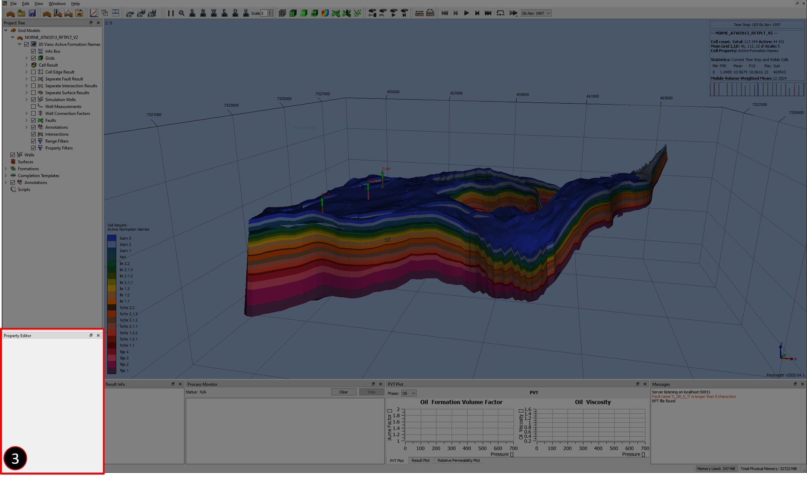
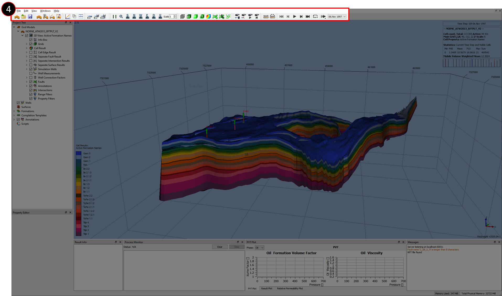
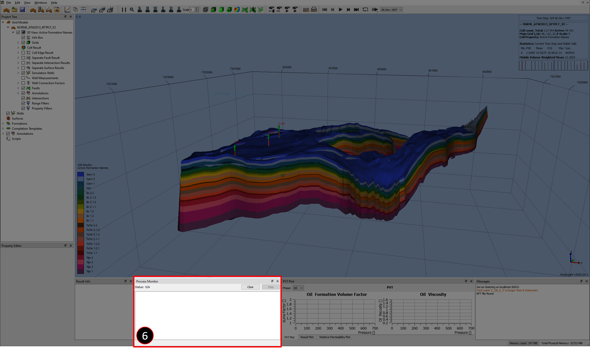
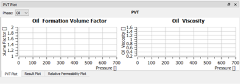
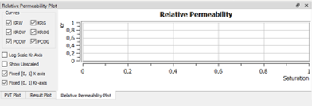

# ResInsight - Graphical User Interface

The ResInsight user interface is made for customization. The sub-windows adapts according to your actions to provide additional relevant information. In this tutorial the standard layout is explained to allow for an easier transition to more advanced operations. The Buttons on the top are directly related to either the project or your current **View** in the Property Tree.

# Overview

The standard view of ResInsight as loaded the first time will be similar to the above image. If you want to skip straight forward to one section, please select the relevant link below.

1. [Reservoir View](#reservoir-view)
2. [Project Tree](#project-tree)
3. [Property Editor](#property-editor)
4. [Quick access buttons](#quick-access-buttons)
5. [Result Info](#result-info)
6. [Process Monitor](#process-monitor)
8. [Result Plot](#result-plot)
7. [Messages](#messages)

# Reservoir View
[Back to overview](#overview)

For information about the Reservoir View go to https://resinsight.org/3d-main-window/3dviews/

# Project Tree
[Back to overview](#overview)

The purpose of the Project Tree exist to manage the views and thereby what  elements of the deck will appear in the main windows. There can be multiple models, views, and properties. Properties can be filtered in several ways and combination of one another. Some filtering mechanisms include location, property value and geometrical indexing.

The actions that you take will directly affect the appearance of the [Property Editor](#property-editor). It will adapt to actions that you perform, if for instance you select [Cell Results](#cell-results) in the [Project Tree](#project-tree) several drop-down menus will appear. These include but are not limited to Static, Dynamic, Generated, Properties, Input Properties etc.

## Cell Results

For information about the Cell Results go to https://resinsight.org/3d-main-window/cellresults/

# Property Editor
[Back to overview](#overview)

The Property Editor is one of several ways to interact with the visualization and its properties. The appearance and values can be selected from several text cells or drop-down menus in a tree structure.

# Quick access buttons
[Back to overview](#overview)

## Project/File Management buttons

These buttons are used for managing the project. Either by Loading and Saving project, Eclipse Files, and ensembles.

## Window Management buttons

These buttons provides access to the Plot Main Window and "Tile View" to better organize your visual experience with the reservoir.

## Snapshot Tools

These buttons allows for tailoring of the Screen Capture tools. The options are to print the current **View** to your clip-board (Equivalent to Ctrl + C), save your current **View** to a file, and to save all of your **Views** to files.

## View (orientation and transformation) buttons

"Parallel View" / "Perspective View" adjusts the view accordingly. "Zoom all" adjusts the visualization to include the entire reservoir. "Look South(/North/West/East/Down/Up)" buttons are helpful for aligning your view with the different axis. "Scale" allows you to scale the Z-axis.

## Draw Style buttons

Gives you access to the different modes of visualizing the reservoir in terms of lighting, mesh, surfaces, faults, and wells. 

## Animation buttons

The animation buttons will helps visualize the reservoir chronologically through time, either backwards or forwards. Selecting the speed of the animation or displaying a given report step.

# Result Info
[Back to overview](#overview)

The Result Info window will be where several of the results can be obtained. If the [Cell Results](#cell-results) have been set to display pressure, one can click on the reservoir to display the pressure of the selected cell.

When a cell is probed it will usually display the current cell property, Grid, Cell IJK coordinates, Global Cell Index, Intersection Point, and Formation Name if such information is provided.

# Process Monitor
[Back to overview](#overview)

If Octave scripts are being run; the Process Monitor is the sub-frame which will display the current status and any text output. You can also clear the text and stop the process.

# Result Plot / Relative Permeability / PVT Plot
[Back to overview](#overview)

## PVT plot

Shows the PVT state for the given report step.

## Result plot

Displays the Results for the given [Cell Result](#cell-results) through time.

## Relative Permeability Plot

Displays the relative permeability.

## References:

For more information go to https://resinsight.org/3d-main-window/resultinspection/

# Messages
[Back to overview](#overview)

Displays the log of ResInsight, giving you information of which project is currently being loaded and when it is complete.

