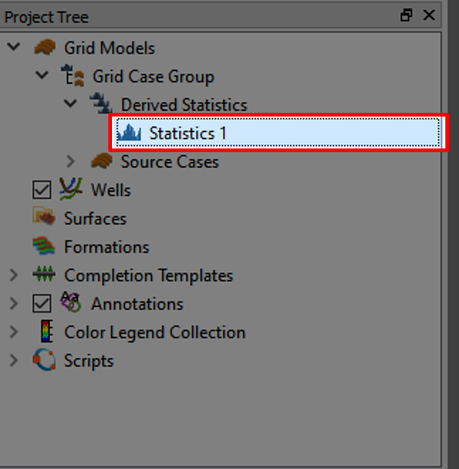
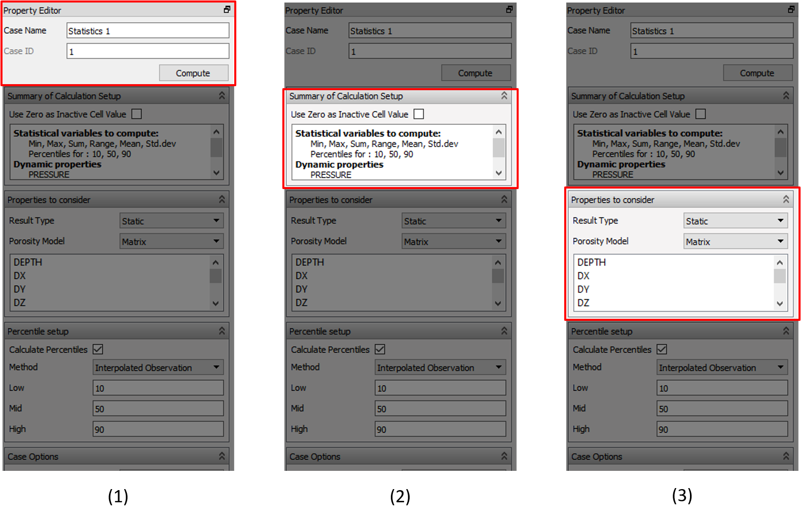

# Grid group statistics

# Step 1: Create a Case Group

As illustrated in the above picture, select the `File->Import->Eclipse Cases->Import Grid Case Group from Files Recursively`. This will bring up a prompt, where you should select the folder of the ensemble.

Use the "..." button to find the root folder of the ensemble. This will recursively search the subfolders to find any ".EGRID" files.

It should look like the above picture. Press "OK" to confirm. This will bring a new item to the [Project Tree](../graphical-user-interface/graphical-user-interface.md#project-tree)

# Step 2: Create statistics across the Ensemble

Inside the new item we find "Derived Statistics" and "Source Cases". If we now click on the "Derived Statistics" there will appear new parameters in the [Property Editor](../graphical-user-interface/graphical-user-interface.md#property-editor). 

 

In the above picture we highlight some of the most important items in the Property Editor. 
1. This tab enables you to set a new case name. In addition, the execution is performed here.
2. This tab shows the highlights of what type of calculations will be performed
3. This is the tab where you select the properties that will be calculated according to item 2. in this list

In our case, we want to select the "PORO" (porosity) and then execute the calculations by pressing the "Compute" button.

# Step 3: Visualize the generated statistics

In the new view, select [Cell Results](../graphical-user-interface/graphical-user-interface.md#cell-results) as shown in the picture above.

In the Property Editor, select "Static", and all the calculated will be displayed. Visualize the properties by clicking on these properties.

# References:

For information go to: https://resinsight.org/3d-main-window/casegroupsandstatistics/