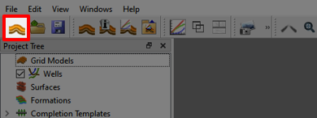
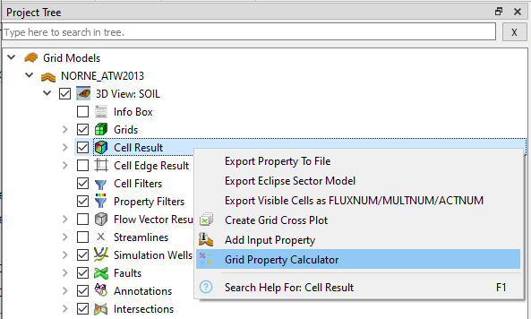
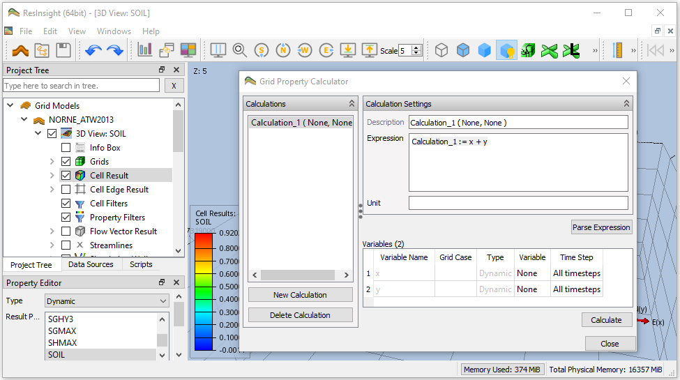
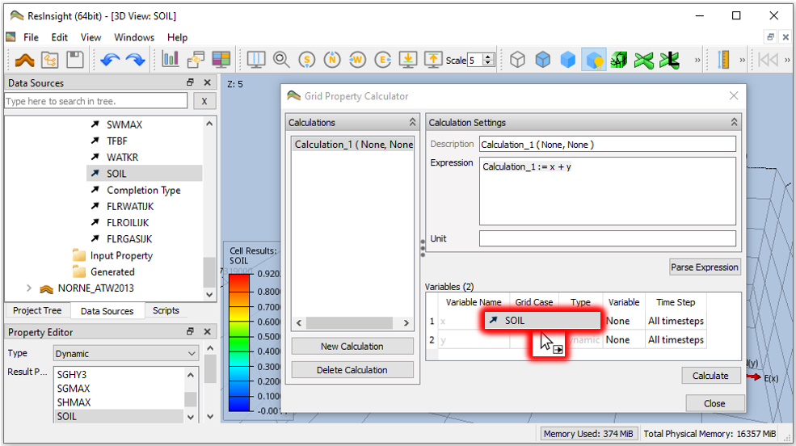
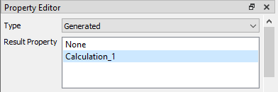
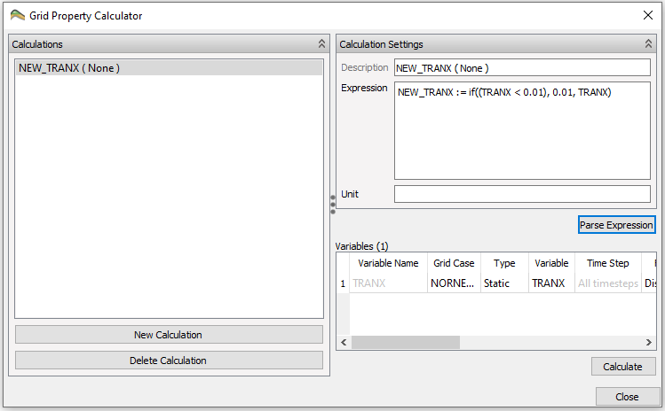

# Grid Property Calculator

ResInsight offers a built-in **Grid Property Calculator** which enables arithmetic expressions to be parsed and calculated for visualization purposes.

## Step 1. Import case from Eclipse
First, import an Eclipse case by using the toolbar button *Import Eclipse Files* and navigate to select an Eclipse file.

## Step 2. Invoke the Grid Property Calculator
Invoke the **Grid Property Calculator** by right-clicking  **Cell Result** in **Project Tree**.

## Step 3. Specifying expression for calculation
As seen below, the **Grid Property Calculator** is per default prefilled with the simple summation *Calculation_1 := x + y*. We will use this simple summation to exemplify its use.

## Step 4. Specifying properties for the calculation
The next step is to define the variables *x* and *y* by drag and drop of properties from **Data Sources**. First drag and drop *SOIL* from **Data Sources** to the row of variable *x* in **Grid Property Calculator**. Continue with drag and drop of *SGAS* to define *y*.

## Step 5. Perform calculation and visualize the result
Finally, press **Calculate** to perform the actual calculation. 

The calculated result is accessable in **Project Tree** by clicking  **Cell Result** and looking up *Type* **Generated** **Result Property** in **Property Editor**.
Click *Calculation_1* to visualize the calculated property.

## Step 6: Changing calculation to introduce a conditional statement
Change the *Expression* field in **Grid Property Calculator** to the if-statement shown below which ensures that TRANX values below 0.01 is set to 0.01 while keeping all values above value 0.01.

Press the button *Parse Expression* to update the list of variables and validate the expression.
Then drag and drop the *Static* property TRANX to define the sole variable TRANX emerging in *Variables*. 
Subsequently, press *Calculate* and visualize the generated result property *NEW_TRANX* (c.f. Step 5).

You may further change the name of calculation and add additional variables and arithmetic operators using the *Expression* field of **Grid Property Calculator**. 

