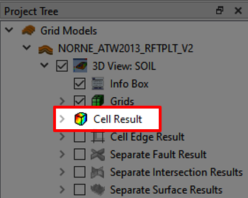
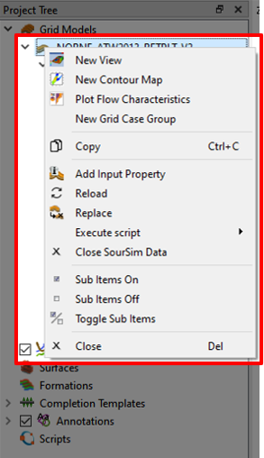
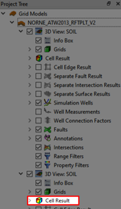
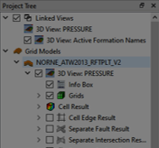

# 3D Grid Visualization

## Step 1 - Import Eclipse Case

Import grid data by using the "Import Eclipse Case"-button from the folder "grid-visualization"

## Step 2 - Visualizing Dynamic Properties

In the [Project Tree](../graphical-user-interface/graphical-user-interface.md#project-tree) select [**Cell Results**](../graphical-user-interface/graphical-user-interface.md#cell-results), then navigate to the [Property Editor](../graphical-user-interface/graphical-user-interface.md#property-editor) and select a "Type", in this case Dynamic. Further, find the "PRESSURE" property from the drop-down menu and select it. This will load the property on to your current view.

## Step 3 - Animation and Report Steps

Use the Play button in the [animation button](../graphical-user-interface/graphical-user-interface.md#animation-buttons) to get to the last step. Make sure that neither the "Repeat From Start" nor the "Repeat Forwards/Backwards" are checked. You can also select the last time step by using the drop-down menu in the animation part of the quick access bar.

## Step 4 - Import formation names

Navigate to `File->Import->Import Formation Names` and import the formation names from the `Norne_ATW2013.lyr` file.

## Step 5 - Create a new View and Display Formations

Navigate back to the Project Tree and right-click on "NORNE_ATW2013_RFTPLT_V2" and select "New View" as illustrated in the above picture.

In View 2 select Cell Result and then Navigate back to the Property Editor and select a "Type", in this case "Formation Names" and click the "Active Formation Names" option.

## (OPTIONAL) Step 6 - Show and link multiple views

With the two views active you could click the "Tile Window" in the [Window management](../graphical-user-interface/graphical-user-interface.md#window-management) buttons to visualize both the Views simultaneously. You can even link the views to show the exact same positions by selecting the right-clicking in both [Reservoir View](../graphical-user-interface/graphical-user-interface.md#reservoir-view) 

In additionally, a new menu will appear in the Project Tree that allows you to attach, detach and terminate links.

For more information go to: https://resinsight.org/3d-main-window/linkedviews/
