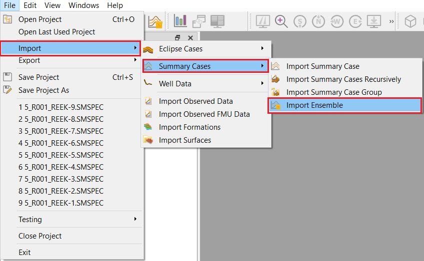
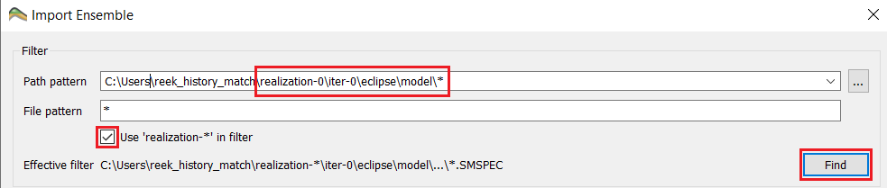
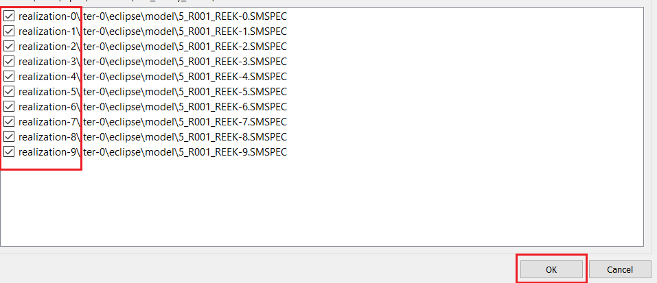
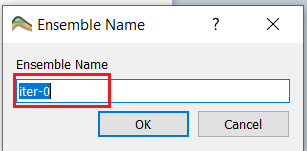

# Import Summary Ensemble

 

Either click the "Import Ensemble" button in the [Quick Access bar](../graphical-user-interface/graphical-user-interface.md#quick-access-buttons) or navigate through the "File" drop-down menu and select 'Import->Summary Cases->Import Ensemble'. or Navigate through the "File" drop-down menu and select 'Import->Summary Cases->Import Summary Ensemble' as shown above. 

 

A prompt will appear; select the "..." (as illustrated in the above picture) and navigate to the folder which contains the ensemble. It will appear a file-path to the folder you have selected. In our case we are using the Reek ensemble. 

 

The Reek ensemble we are working with contains 9 realization each having four iterations ranging from iter 0 to iter 3. To import the iter-0 ("base_pred") we go to the model file of iter-0 of realization-0 and enable the checkebox "Use realization-* in filter" as shown above to replace the test relaization-N with the realization-* to be able to selecte ier-0 for available relaizations.

Realization 0 through 9 are found and selected automatically as illustrated in the above screenshot. Now click 'OK'. 

This will open up a new prompt will appear; asking you to name the ensemble. We will call this "iter-0". Then press "OK".
