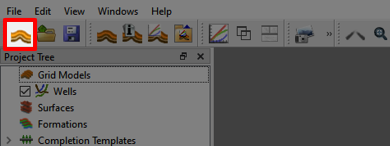

# Making a Well

## Step 1 - Import Eclipse Case

Import grid data by using the "Import Eclipse Case"-button and locate the folder "grid-visualization".

## Step 2 - Preparing to make Well

First, we deselect all the Faults and Simulated Wells as shown in the illustration above.

Then we create an intersection by right-clicking the "Intersections" button in the [Project Tree](../graphical-user-interface/graphical-user-interface.md#project-tree). 

We then head down to the [Property Editor](../graphical-user-interface/graphical-user-interface.md#property-editor), we can select the type of intersection geometry that we would like to make. In this instance we are creating a well from the follow intersection. We therefore select "Polyline" as the geometry.

Next we select "Start Picking Points" such that we can probe the reservoir for coordinates for the "Polyline" intersections.

We then move over to the [Reservoir View](../graphical-user-interface/graphical-user-interface.md#property-editor) where we probe some points similar to the image above.

Stop picking points by selecting the "Stop Picking Points" button in the Property Editor. 

We can now hide the cells of the reservoir by clicking the "Hide Grid Cells" button in the [Quick Access Bar](../graphical-user-interface/graphical-user-interface.md#quick-access-bar). We will now observe that only the selected intersection is displayed.

## Step 3 - Making the well

Head back to the Project Tree. We can now right-click the "Wells" button and select create "Create Well Path".

In the Reservoir View select some points on the intersection. When you select more than one point a Well Path will be created.

When you have selected three points you can click the "Stop Picking Points" button in the Property Editor.

Create a new Intersection by right-clicking on "Well-1" in the "Project Tree" and selecting "Create Intersection"

We can now deselect the "Polyline" intersection by unchecking "Intersection".

If we now select the "Well Target" we can start using the points we picked in an interactive way combined with the visualization of the Well Intersection.

As illustrated in the picture above all points selected when we created the well can be modified. If you click and hold on the purple line you can move the points in the horizontal plane, while the blue arrows allow you to move the point in the vertical direction. Test this feature by moving the last point.

The well should look somewhat like this.

## Step 4 - Exporting the well

We can now export the well path we have created by selecting the "Export Selected Well Paths" option as shown above, this will create a ".dev"-file in your selected location.

In addition you have the option to show the Well Plan by selecting "Show Well Plan". This brings up a window which you can select the details you want to bring and use the clipboard to export.

