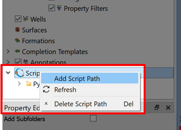

# Post-processing and Scripting with Octave

## Step 1. Import case from Eclipse

First, import the Eclipse case by selecting the "Import Eclipse Files" and navigating to the Eclipse Files, in this case the "grid-visualization".

## Step 2. Locate Octave Script 

### (Optional) - If Octave is not already installed on your system
Follow the link in [References](#references) 

By right-clicking the **Scripts** menu and selecting "Add Script Path", then locate Octave Script `post-processing-with-octave/TimeDiff_SOIL.m`.

## References
[ResInsight install instructions](https://resinsight.org/getting-started/download-and-install/)