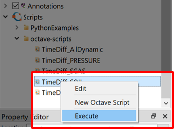

# Post-processing and Scripting with Octave

## Step 1. Import case from Eclipse

First, import the Eclipse case by selecting the "Import Eclipse Files" and navigating to the Eclipse Files, in this case the "grid-visualization".

### Step 2. (Optional) - If Octave is not already installed on your system
Follow the link in [References](#references) 

## Step 3. Import Octave Script paths 

By right-clicking the **Scripts** menu in the Project Tree and selecting "Add Script Path", then locate Octave Script `post-processing-with-octave/Resources/octave-scripts`.

## Step 4. Executing the Script

Execute the script by right-clicking the script and clicking "Execute". You can also observe in the [Process Monitor](../graphical-user-interface/graphical-user-interface.md#process-monitor) that the script has been completed.

## Step 5. Visualizing the results from the post-processing step.

To visualize the results generated by the script, select [**Cell Results**](../graphical-user-interface/graphical-user-interface.md#cell-results) in the [Project Tree](../graphical-user-interface/graphical-user-interface.md#project-tree). Then navigate to the [Property Editor](../graphical-user-interface/graphical-user-interface.md#project-tree) and select a different "Type" called "Generated".  

## Step 6. Export to GRDECL text-file

## References
[ResInsight install instructions](https://resinsight.org/getting-started/download-and-install/)

For more Equinor internal scripts, see the following file system location: `/project/res/share/riOctaveScripts`