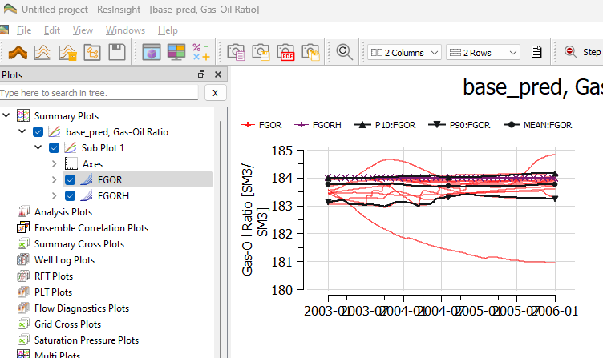
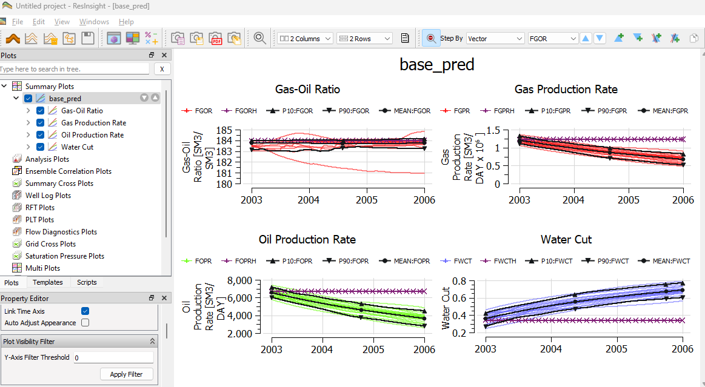
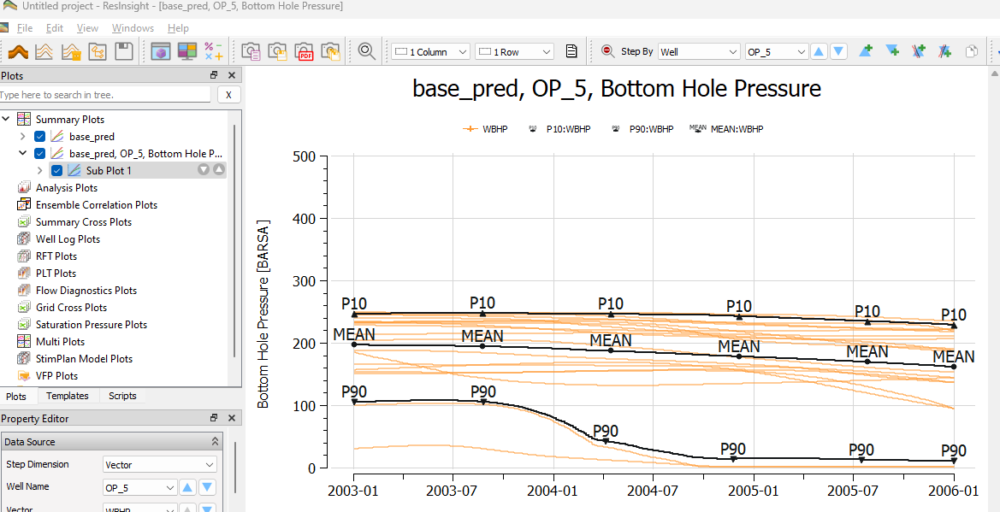
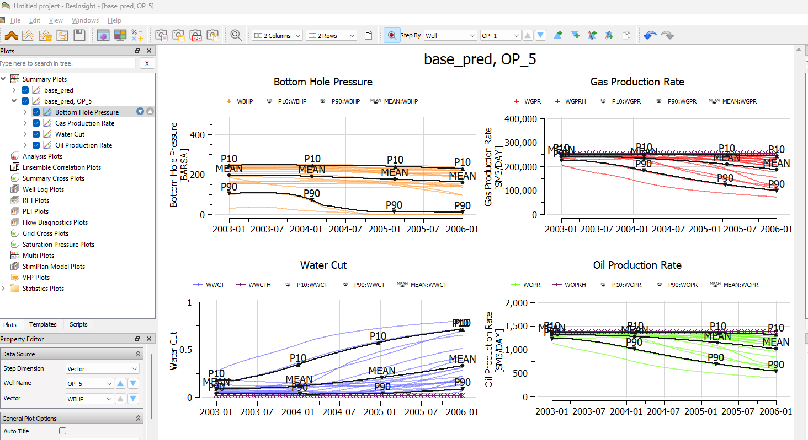
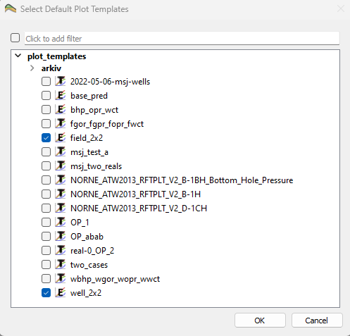
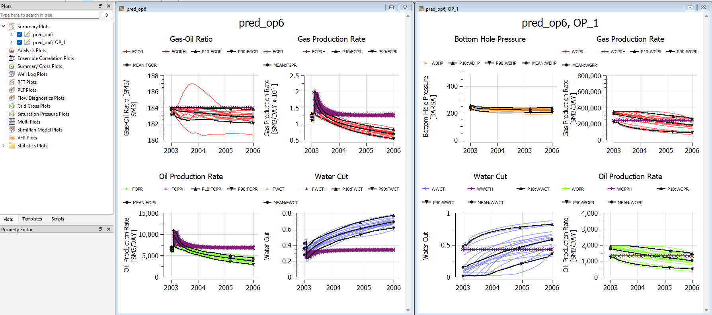
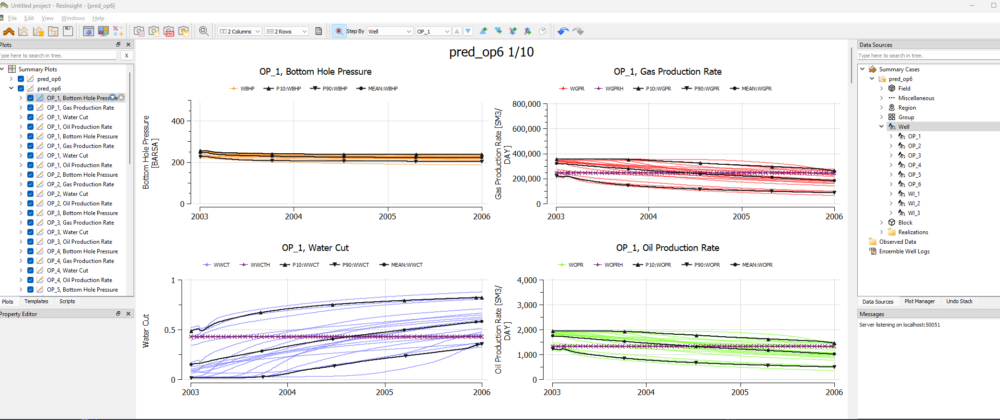

# Preparing Ensemble Plot Templates
Objective is to store plot setup with customized curve appearance for reuse on different datasets.

## Importing an Ensemble

Import an ensemble as described in [this tutorial](../summary-ensemble/summary-ensemble.md)

## Create a 2x2 Field Plot Template

Create a new plot with field vectors FGOR and FGORH. Make sure that the plot is set to 2 columns and 2 rows using the toolbar.

    

Right-click FGPR and select "Append Plots for Vector". The plot is appended to the current plot. Repeat for FOPR and FWCT.

    

Reorder the plots by drag and drop in the Plots tree view.

Right-click the plot, and select "Save as Plot Template" Give the template a name like "Field_2x2"

## Create a 2x2 Well Plot Template

Create a new plot with well vector WBHP. Make sure that the plot is set to 2 columns and 2 rows using the toolbar.

    

Right-click FGPR and select "Append Plots for Vector". The plot is appended to the current plot. Repeat for FOPR and FWCT.

    

Right-click the plot, and select "Save as Plot Template" Give the template a name like "Well_2x2"

## Set default Plot Templates
 Open Preferences, and activate the Plotting tab. Click on the button "Select Default Templates"

 Select the field template and the well template. Close all projects.

    

 ## Import a new ensemble
Import a new ensemble, and a field plot and a well plot is created based on the selected templates.

    

## Append plot for all wells
Make sure that the currently selected plot is the well plot.
From the right-click menu of Data Sources -> Wells, select "Append Plots for Wells". The well plot template is applied and appended for all selected wells. One page for each well is now available in the plot, and the scroll bar to the right or PgUp/PgDown can be used to navigate to the relevant page.

    
