# Preparing Plot Templates
Objective is to store plot setup with customized curve appearance for reuse on different data.

## Step 1: Importing summary cases

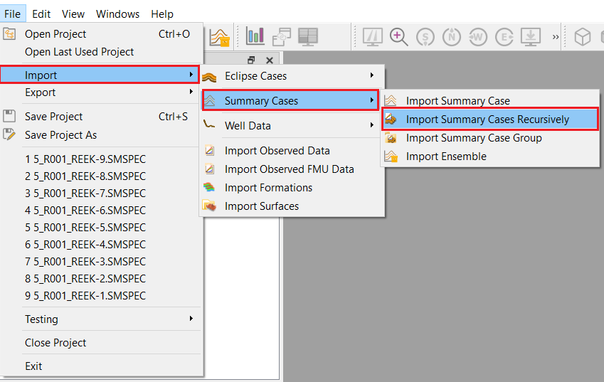 

Navigate through the "File" drop-down menu and select 'Import->Summary Cases->Import Summary Cases Recursively' as shown above.

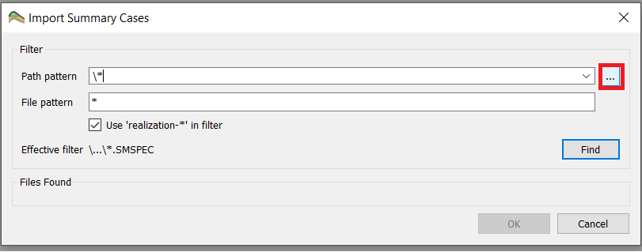 

A prompt will appear; select the "..." (as illustrated in the above picture) and navigate to the folder which contains the ensemble. It will appear a file-path to the folder you have selected. In our case we are using the Reek ensemble.

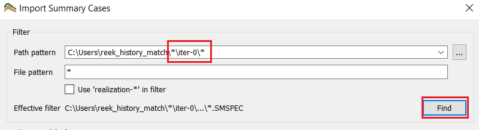 

The Reek ensemble we are working with contains 9 realization each having four iterations ranging from iter 0 to iter 3. To import the iter-0 ("base_pred") we add the following syntax to the file path: "\*/iter-0/\*", the astrix symbol ("\*") means that it will match any number of any character. As the above illustration shows, press the "Find" it will search for all the ".SMSPEC" files associated with the "iter-0".

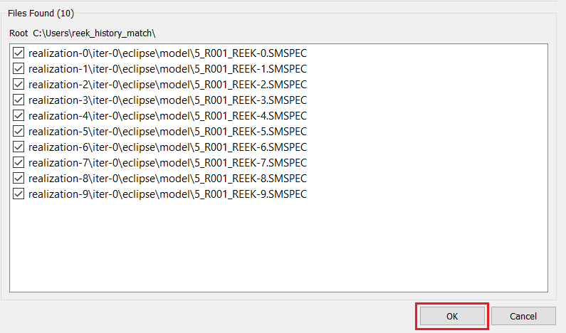

Select realization 0 through 9, as illustrated in the above screenshot and click 'ok'. This will open up the plot window.

## Step 2: Create Summary Plot

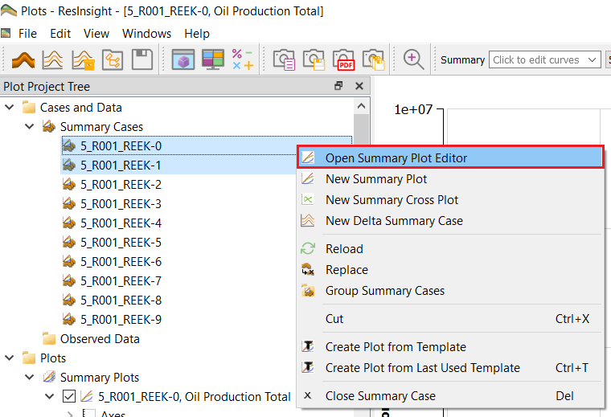    

Select two summary cases in the project tree and from right-click menu select "Open Summary Plot Editor" as shown above.
 
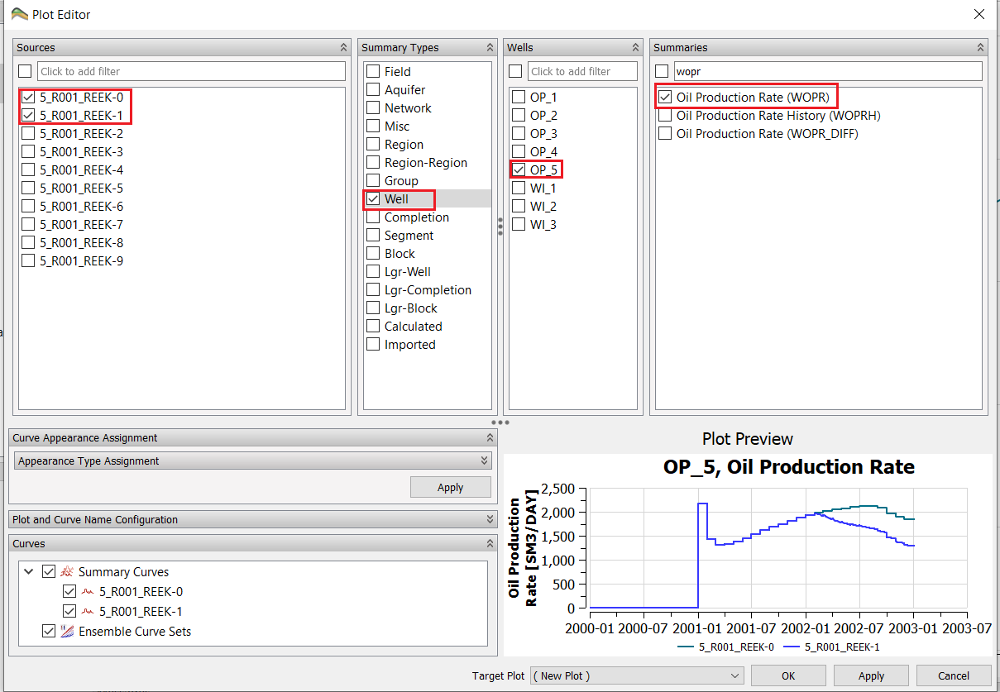 

As the screen shot above illustrates we now want to select "Well", "OP_5" and the property we are interested in displaying. In our case this will be the Oil Production Total or "WOPT", select in the scrolling window or use the search functionality on top to find it. 

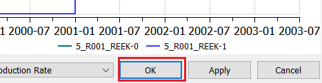 

Confirm the choice and display the graphs by clicking the OK button. 

## Step 3: Change the plot appearance 

### General Plot Options

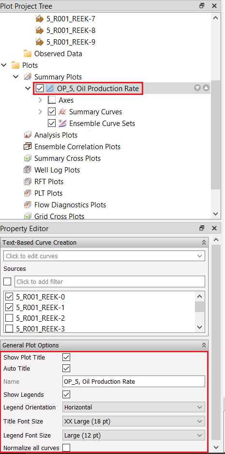 

### Changing curve appearance

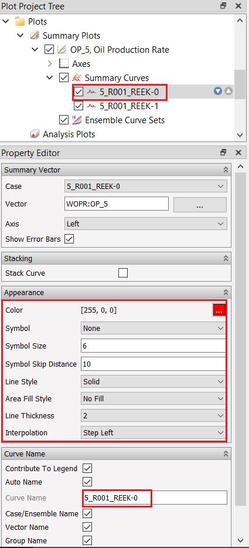 

### Changing aixs settings

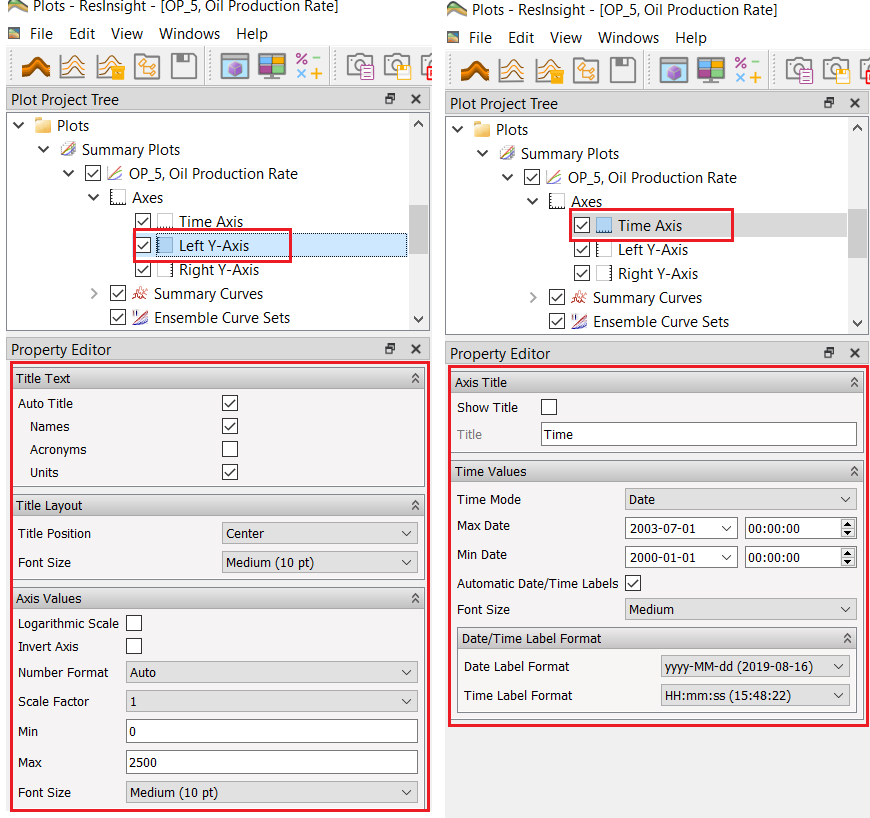 

Change the curve appearance of the two curves the way you linke best. For example, rename the title, increase font size of axis labels and legends, changing color of curves, line style are some options to begin with.

## Step 4: Save plot template

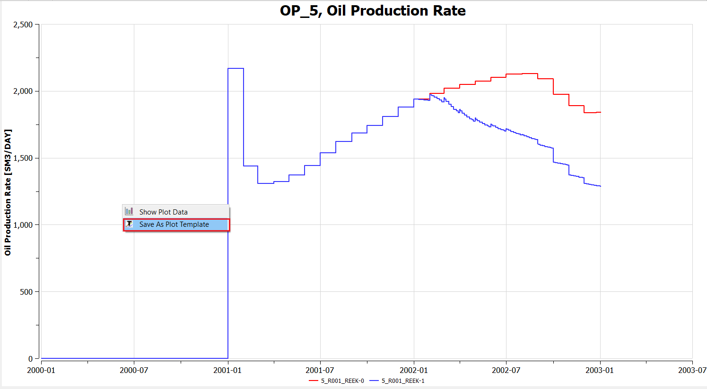

Once desired curve appearance is achieved, in the plot area, right-click and select "Save as Plot Template". Create a folder inn your user area and store this template in thsi folder using the template name "wopr_two_cases" as illustated below.

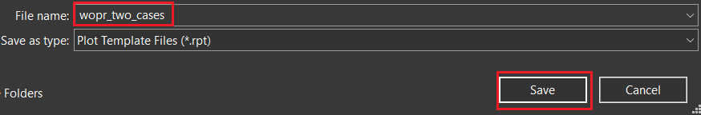 

## Step 5: Apply an existing template

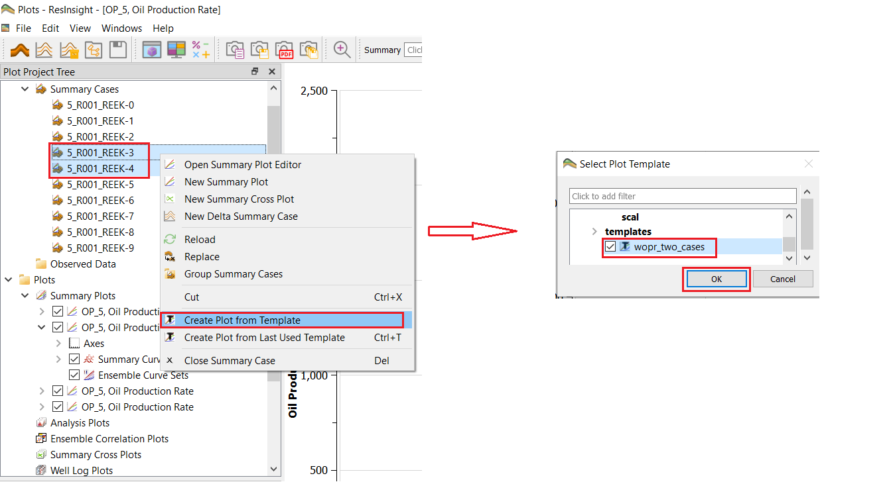  

In the project tree , select two other summary cases than the ones used to produce template. From the right-click menu, select " Create Plot from Template" and select the recently created template as illustated above.

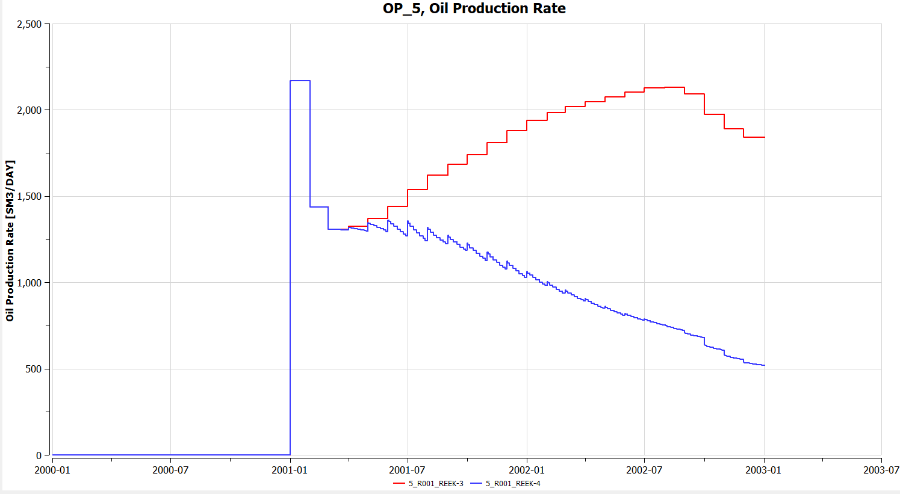  

Visual settings you stored in the template should be applied to the generated plot as shown above.

