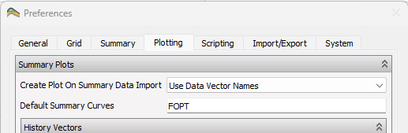
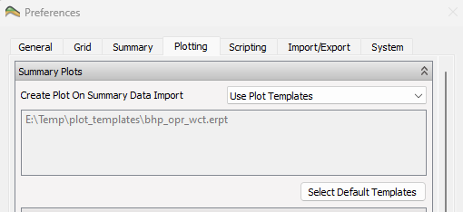
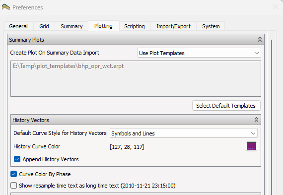
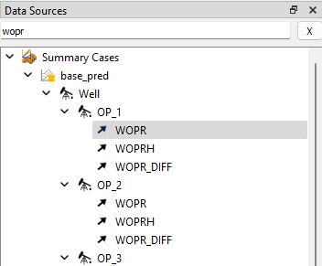
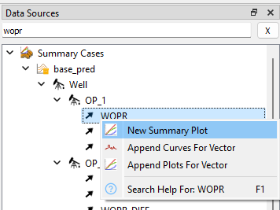
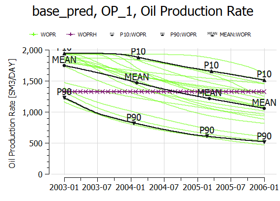
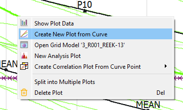
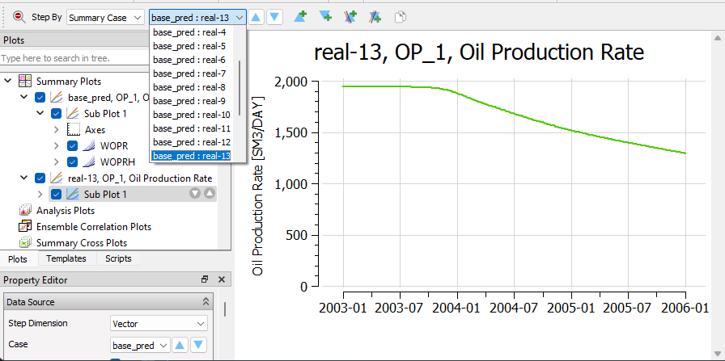
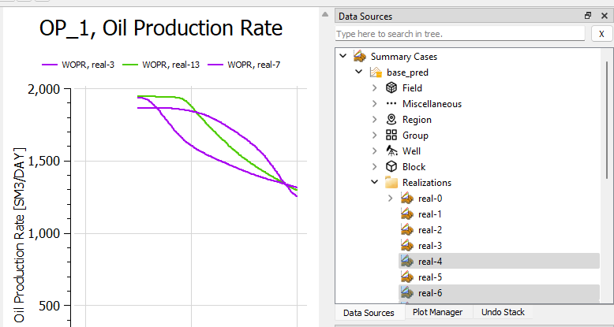

# Ensemble Plotting

## Importing an Ensemble

Import an ensemble as described in [this tutorial](../summary-ensemble/summary-ensemble.md)

## Default plots

In preferences, the default plot can be specified. This can either be one or more summary vector or one or more templates.

 

## History Vector Appearance

History vectors can optionally be appended when a summary vector is added to a plot. Default curve style and curve color can also be defined.

## Use Phase to define Curve Color

From preferences, it is also possible to activate curve colors by phase. This will use a default curve color for oil(green), red(gas) and water(blue). The curve color can be activated for both sigle curve and ensemble curve display.

## Creating an Ensemble Plot for Well OP_1

Make sure preferences is set to color curve by phase, and append history vector during create or append operations.

Type "WOPR" in the search field in **Data Sources**

Select "New Summary Plot" from the right-click menu of **WOPR**

A plot with both WOPR and WOPRH is created. Note that the default curve color is green, and the default curve style for the history vector is set according to preferences.

Individual curves can be highlighted when clicking on curves. Activate the right-click menu on a curve to show the curve as a single curve in a new plot.

Investigate other realizations using the source stepping toolbar.

Drag and drop other realizations into the plot to compare different curves.

## Documentation References
[Summary Plots](https://resinsight.org/plot-window/summaryplots/)

[Ensemble Plots](https://resinsight.org/plot-window/ensembleplotting/)

[Preferences](https://resinsight.org/misc/preferences/#plotting)

