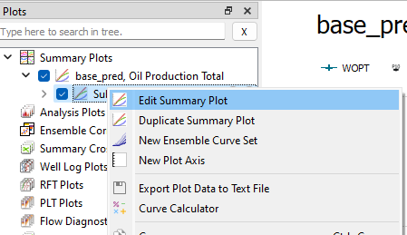

# Ensemble Plotting

## Step 1. Importing an Ensemble

 

Either click the "Import Ensemble" button in the [Quick Access bar](../graphical-user-interface/graphical-user-interface.md#quick-access-buttons) or navigate through the "File" drop-down menu and select ´Import->Summary Cases->Import Ensemble´

A prompt will appear; select the "..." (as illustrated in the above picture) and navigate to the folder which contains the ensemble. It will appear a file-path to the folder you have selected. In our case we are using the Reek ensemble.

The Reek ensemble we are working with contains one base prediction, iteration 1, iteration 2, and "pred_op6". To import the base prediction ("base_pred") we add the following syntax to the file path: "\*/base_pred/\*", the astrix symbol ("\*") means that it will match any number of any character. As the above illustration shows, press the "Find" it will search for all the ".SMSPEC" files associated with the "base_pred".

## Step 2. Creating an Ensemble Plot for Well OP_5

A plot will appear showing the "Base prediction, Oil Production Total". We want to replace this curve with the curve showing the cumulative oil production of "OP_5". 

First, we click "Edit Summary Plot". This will allow us to alter the default curve.

Then we deselect the "Field" Summary Type, the plot will now be blank.

As the screen shot above illustrates we now want to select "Well", "OP_5" and the property we are interested in displaying. In our case this will be the Oil Production Total or "WOPT", select in the scrolling window or use the search functionality on top to find it.

Confirm the choice and display the graphs by clicking the OK button.

## Step 3. Change the Plotting Color to be plotted by parameter values.

By selecting the curve, new properties will appear in the [Property Editor](../graphical-user-interface/graphical-user-interface.md#property-editor). Here you can select the color scheme of the plot, in our case we want to change it from "Single Color" to "By Ensemble Parameter"

