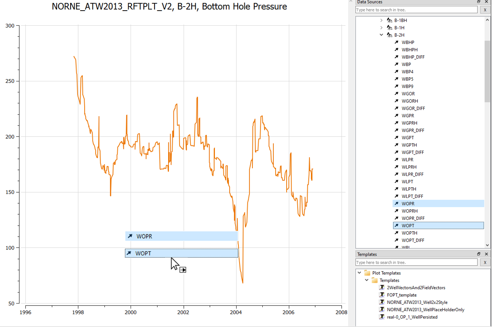
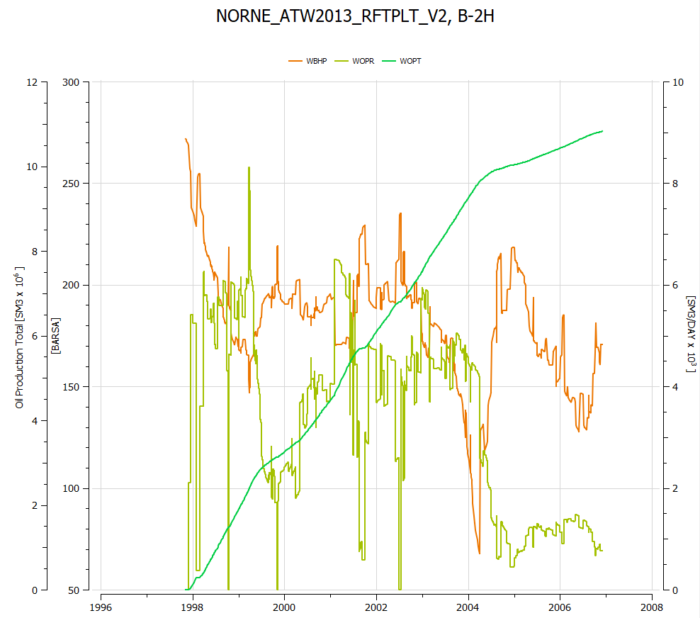
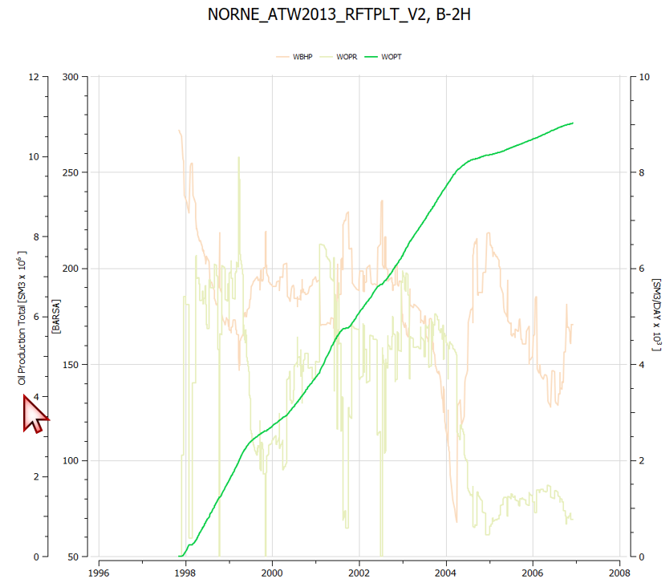

# Summary Plotting - Multiple axes

## Load Summary Case

1. Click the toolbar button  to open **Plots** window or use the shortcut *Ctrl+Shift+P*.
2. Click the toolbar button 
to import summary case, navigate to directory *model-data/norne*, select *NORNE_ATW2013_RFTPLT_V2.SMSPEC*, and click *Open*.

## Create a summary plot

1. Invoke **Data Sources** window by menu option *Windows&rarr;Data Sources*
2. Navigate to well *B-2H*, right-click vector *WBHP* and select **New Summary Plot**.
3. Set plot columns and rows both to 1 instead of 

## Drag/Drop wells

1. Continuing with the plot of *WBHP* for well *B-2H*
2. Drag *WOPR* and *WOPT* for the same well into the same plot

## Resulting summary plot
The procedure above creates a multi-summary plot containing the following curves.

1. Notice that ResInsight automatically creates multiple axes due to differing units
2. Click on an axis of interest to highlight the related curve(s) 

