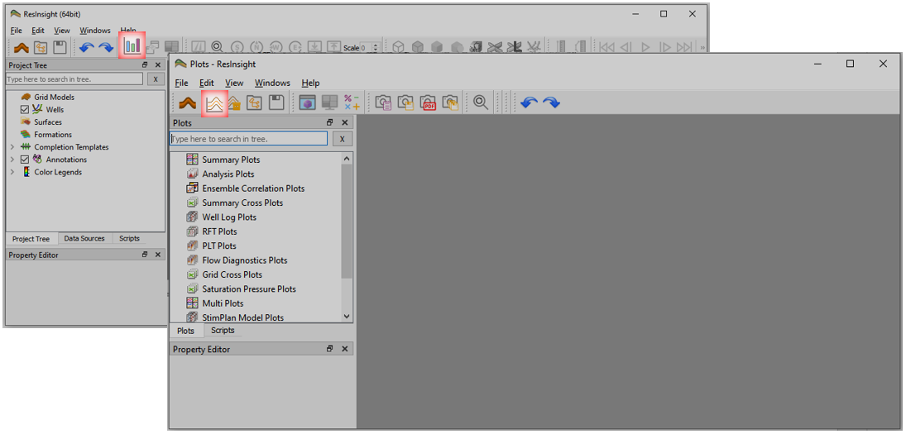
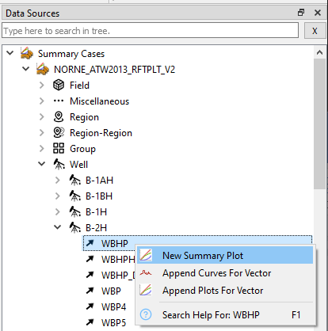
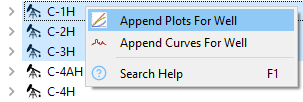
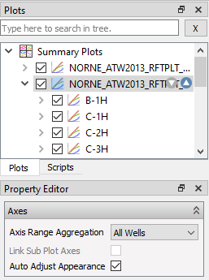
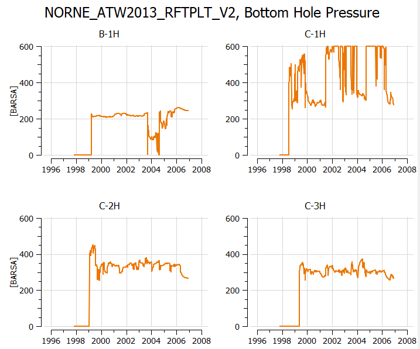

# Summary Plotting

## Load Summary Case

1. click toolbar button  to open **Plots** window or use the shortcut *Ctrl+Shift+P*.
2. click toolbar button 
to import summary case, navigate to directory *model-data/norne*, select *NORNE_ATW2013_RFTPLT_V2.SMSPEC*, and click *Open*.

## Create summary plot

1. Invoke **Data Sources** window by menu option *Windows&rarr;Data Sources*
2. Navigate to *Well B-2H*, right-click WBHP and select **New Summary Plot**.

## Change data source

- By the toolbar  you may for instance:
  - change well by pressing the up and down buttons
  - change vector by switching **Step By** to *Vector* and use the up and down buttons
- Use keyboard shortcuts *CTRL &larr;* or *Ctrl &rarr;* to swiftly change data source set by **Step By**

## Create plots for a selection of wells

1. Right click selected wells, and select **Append Plots for Well**
2. Adjust the number of columns and rows for each page 
3. Use PgUp/PgDown or scroll wheel to navigate the document of plots

## Visual comparison of plots

1. Click the plot in **Plots** window
2. In **Property Editor**, set *Axis Range Aggregation* to *All Wells* to harmonize axes across all wells
3. Check *Auto Adjust Appearance* to have ResInsight to automatically adjust the plot for best appearance 

## Resulting summary plot
The procedure above creates the following multi-summary-plot.

