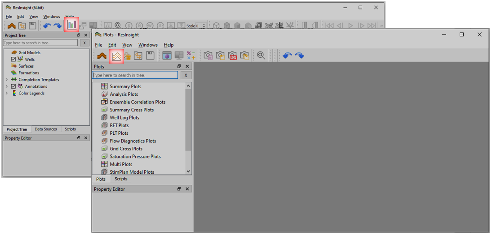
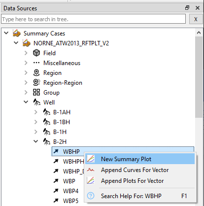
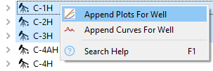
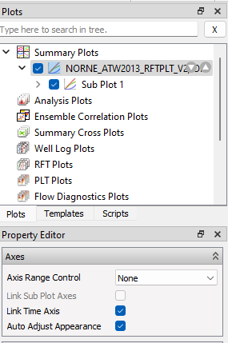

# Summary Plot Export

## Load Summary Case

1. Click toolbar button  to open **Plots** window or use the shortcut *Ctrl+Shift+P*.
2. Click toolbar button 
to import summary case, navigate to directory *model-data/norne*, select *NORNE_ATW2013_RFTPLT_V2.SMSPEC*, and click *Open*.

## Create a summary plot

1. Invoke **Data Sources** window by menu option *Windows&rarr;Data Sources*
2. Navigate to *Well B-2H*, right-click vector *WBHP* and select **New Summary Plot**.

## Append plots for a selection of wells

1. Select a number of wells, right-click and select **Append Plots for Well**
2. Adjust the number of columns and rows for each page 
3. Use PgUp/PgDown or scroll wheel to navigate the document of plots

## Page Preview

1. Click the toolbar button *Page Preview*
2. Click the plot in **Plots** window and:
   - In **Property Editor**, set *Axis Range Aggregation* to *All Wells* to harmonize axes across all wells
   - Check *Auto Adjust Appearance* to have ResInsight automatically adjust appearance
3. Validate the page layout for export
4. If necessary, plot axes may be further adjusted manually - either individually or by checking *Link Sub Plot Axes* to handle the axes collectively.

## PDF Export

1. Select PDF export from toolbar
2. If desired, adjust PDF page size, orientation and margins via **Preferences&rarr;Plotting&rarr;Page Setup**

