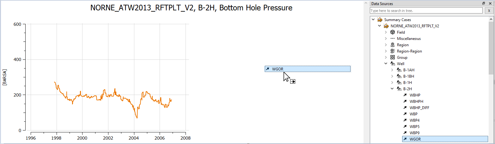
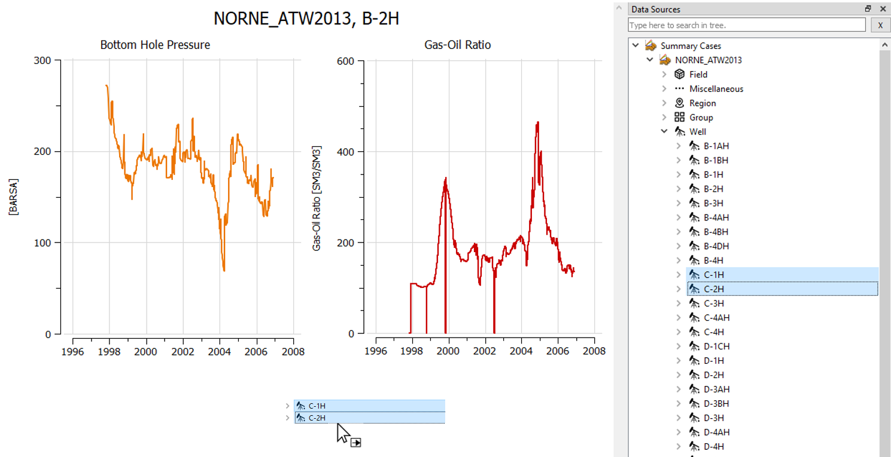
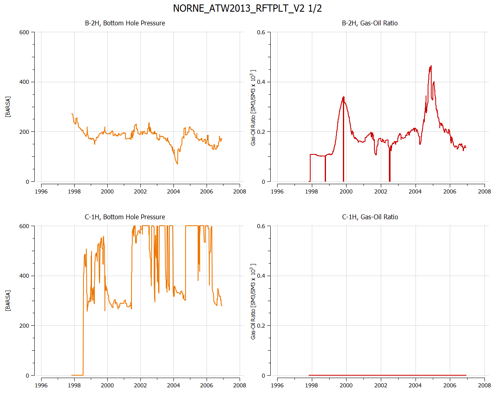
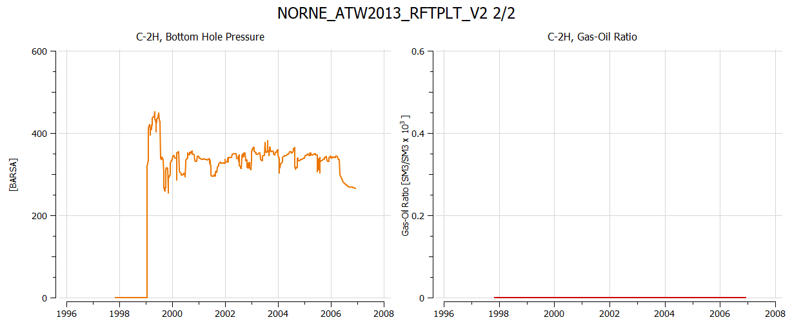

# Summary Plotting - Drag and drop

## Load Summary Case

1. Click the toolbar button  to open **Plots** window or use the shortcut *Ctrl+Shift+P*.
2. Click the toolbar button 
to import summary case, navigate to directory *model-data/norne*, select *NORNE_ATW2013_RFTPLT_V2.SMSPEC*, and click *Open*.

## Create a summary plot

1. Invoke **Data Sources** window by menu option *Windows&rarr;Data Sources*
2. Navigate to *Well B-2H*, right-click vector *WBHP* and select **New Summary Plot**.
3. Set plot columns and rows to 2 

## Drag and drop vectors

1. Drag and drop of *WGOR* of well *B-2H* into vacant space as shown above
2. This creates a separate subplot for *WGOR* of well *B-2H*

Generally, the options for drag and drop of vectors are:
- Drop vectors into vacant space to create a separate plot for each vector
- Drop vectors into an existing plot to add a curve for each vector

## Drag and drop wells

1. Start with the subplots shown above comprising vectors *WBHP* and *WGOR* of well *B-2H*
2. Then drag and drop several wells into vacant space to create corresponding plots for these wells.

## Resulting summary plot
The procedure above creates two pages of summary plots as follows.

