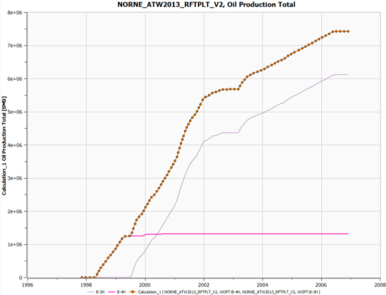

# Summary Plotting

## Step 1. Loading the Summary case

Open the "Plot Window" by clicking this button on the [Quick Access bar](../graphical-user-interface/graphical-user-interface.md#quick-access-buttons) or pressing the shortcut "ctrl+shift+P"

Then click the "Import Summary Case" button and navigate to the "model-data/norne" directory, select "NORNE_ATW2013_RFTPLT_V2.SMSPEC" and click "Open".

## Step 2. Selecting curves to visualize

First, right-click on the plot generated by default and select "Edit Summary Plot".

Then de-select the checked box to remove the curve. If you cannot find this in the window, scroll down or use the search functionality on the top and write "FOPT".

Now, we can plot different curves. Locate the "Well Oil Production Totals (WOPT)" by unchecking "Field" in "Summary Types" and select "Well" in the same column. A list will appear to the right displaying the names of the simulated wells.

Select **B-3H** and **B-4H**, go to the "Summaries" coloumn and select "WOPT" and close the dialog box by clicking "OK"

## Step 3. Using data from curves to generate additional curves

Open the "Curve Calculator" by selecting the button as illustrated above. In the previous step we selected one property from the "B-3H" and "B-4H", we would now like to calculate the sum of the two.

By clicking the "Edit" button, we can select these properties again. ([WOPT for B-3H](./Resources/Pictures/well_1.png) and [WOPT for B-4H](./Resources/Pictures/well_2.png))

Then execute the calculation by clicking the "Calculate" button and close the window by clicking "Close".

## Step 4. Plotting a Calculated curve.

Head back to the "Edit Summary Plot" following the same procedure as in **Step 2**. Now, we want to add the calculated curve to the summary plot. This can be done by adding "Calculated" in "Summary Types" and then selecting the only curve inside. Close the dialog by clicking "OK"

You will now have a plot that shows the "Well Oil Production Total" of both "B-3H" and "B-4H" in addition to the sum.

