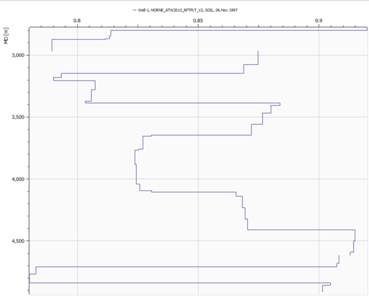
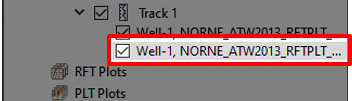

# Well Log Extraction

## Step 1: Open an existing project

First, we open up the existing project. Click "File->Open Project" or press "Ctrl+O" navigate to "Resources/Model/well-log-extraction.rsp". Another possibility is to redo the tutorial [Making A Well](../making-a-well/making-a-well.md)

## Step 2: Create a Well Log Extraction Curve

From the existing well in the [Project Tree](../graphical-user-interface/graphical-user-interface.md#project-tree) right-click and follow the "Well Plots" menu until the "New Well Log Extraction Curve" appears. Press that and a new window will appear.

By default, the Well-1 curve will be selected. As illustrated above, make sure that this option is colored.

Move down to the [Property Editor](../graphical-user-interface/graphical-user-interface.md#property-editor) in the new window. Here make sure that "SOIL" (Oil saturation) is selected.

The first curve should look similar to this. The scale is displayed above while the measured depth is recorded on the left. We observe that the oil saturation surrounding the current well is high. One such window is called a Track.

## Step 3: Add an additional property to the current Track

To add a new curve, right-click "Track 1" and add press the "New Well Log Extraction Curve".

Make sure that the second item in the menu is selected, as illustrated above.

We can now move down to the Property Editor and select the other property. We will add the "SWAT" (Water Saturation) from the "Dynamic" properties to the current Track.

It should look similar to the above figure. As you can see from the top, they share the same scale. If the properties you want to display are of vastly different magnitudes, this view will not suite that task. The next step is therefore to create an additional Track.

## Step 4: Add an additional Track.

In the Project Tree we start off by deleting the last item in the previous track, as replicated above.

Right-click "Well Log Plot 1" and select "New Track".

Make sure that the item "Well-1" in Track 2 is selected, as illustrated above.

We move back down to the Property Editor; here we again find the SWAT (Water Saturation) property under "Dynamic".

When this property is selected, the view should look like the one above. These steps can be repeated for any static
or dynamic property. Now, add a third Track and select PRESSURE as the property.

## Step 5: Export to PDF

Export the current view to a PDF file by clicking the "Export View to PDF" button in the [Quick Access Bar](../graphical-user-interface/graphical-user-interface.md#quick-access-bar) and naming the file something appropriate.
